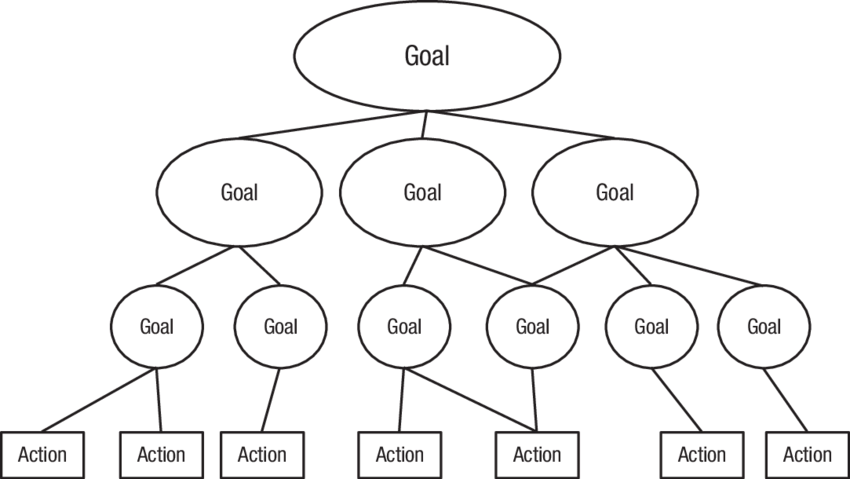

# Grit
{: .no_toc }

  

    Table of contents
  

1. TOC
{:toc}

# Chapter 1: Showing Up
## grit
{: .no_toc }
- combination of _perseverance_ and _passion_
- opposite of complacent
- grittier means more likely to have higher education, more likely to be successful

# Chapter 2: Distracted by Talent
_talent is not all there is to achievement_

## talent vs achievement
{: .no_toc }

> aptitude does not guarantee achievement (17)

- talent is not destiny

## francis galton
{: .no_toc }
- half cousin to Charles Darwin
- studied why people succeed and others fail
- was a _wunderkind_, at 4 could read and write, at 6 knew Latin and could recite passages from Shakespeare from memory
- thought successful were remarkable in three ways: demonstrate unusual "ability" in combination with exceptional "zeal" and "the capacity for hard labor"

## naturalness bias
{: .no_toc }
- which is more important to success, talent or effort? many people report effort, but history belies that: we love the natural.

> a hidden prejudice against those who've achieved what they have because they worked for it, and a hidden preference for those whom we think arrived at their place in life because they're naturally talented (25)

- manifests in the natural vs. striver phenomenon

## william james
{: .no_toc }
- Harvard psychologist, wrote _The Energies of Men_ about how people differ in their pursuit of goals
- declared there is a gap between potential and its actualization
- "The plain fact remains that men the world over possess amounts of resource, which only very exceptional individuals push to their extremes of use"

## the war for talent
{: .no_toc }
- older book, basic premise that companies in the modern enconomy rise and fall depending on their ability to attract and retain "A players"
- companies that excel aggressively promote the most talented employees and get rid of the least talented
- this "talent mindset" led directly to Enron and Jeff Skilling

> the biggest reason a preoccupation with talent can be harmful is simple: By shining a spotlight on talent, we risk leaving everything else in the shadows. We inadvertently send the message that these other factors -- including grit, don't matter as much as they really do (31)

# Chapter 3: Effort Counts Twice

## the mundanity of excellence
{: .no_toc }
- the most dazzling human achievements are the aggregate of countless individual elements, each of which are ordinary

> [...] when we can't easily see how experience and training got someone to a level of excellence that is so clearly beyond the norm, we default to labeling that person "a natural". (37)

> Greatness is many, many individual feats, and each of them is doable. (38)

## mythologizing of talent
{: .no_toc }
 - we prefer our excellence fully formed, mystery to mundanity
 - Nietzsche has plenty to say on the topic: "For if we think of genius as something magical, we are not obliged to compare ourselves and find ourselves lacking ... To call someone 'divine' means: 'here there is no need to compete'"

## theory of achievement
{: .no_toc }
- `talent * effort = skill`
- `skill * effort = achievement`
- theory is incomplete since it is missing luck, but is still useful
- effort counts twice

## treadmill test
{: .no_toc }
- 1940s Harvard test to gauge "stamina and strength of will" and extent which "a subject is willing to push himself or has a tendency to quite before the punishment becomes too severe"
- researchers followed up every two years, and run time was reliable indicator of psychological adjustment through life, even after accounting for physical fitness
- treadmill is apt metaphor for grit, although Duckworth might add another parameter to test, which is to invite subject back next day to see if they could beat their previous score. Those returning would be grittier.

> consistency of effort over the long run is everything. (50)

# Chapter 4: How Gritty Are You?
_grit is more about stamina than intensity_

## grit scale
{: .no_toc }
- invented by Duckworth to test how passionately you pursue goals and how much you persevere
- passion here isn't emotional, it is _consistency over time_
- scale from 1.0 to 5.0, 5.0 being most gritty

> Enthusiasm is common. Endurance is rare. (58)

- sample statements:
  - I am a hard worker
  - Setbacks don't discourage me. I don't give up easily.
  - My interests change from year to year.

## goal hierarchy
{: .no_toc }

- life philosophy
- lower level goals lead to mid level goals, which all leads to a top level goal which is the abiding goal in your life

> The top-level goal is not a means to any other end. It is, instead, an end in itself. (63)
- good not to have too many top level goals, probably best to have one professional one

- **positive fantasizing**, or indulging in positive visions of a future without thinking about how to get there has long-term ramifications but feels good in the moment
- handling goal conflicts is an important part of goal hierarchies -- how do you juggle lower level goals that conflict with two separate high-level goals?

## warren buffet career goal prioritization
{: .no_toc }
- buffet has a task for career goal prioritization
1. write a list of 25 career goals
2. circle the 5 highest-priority
3. avoid the 20 goals at all costs

- while this is absolutist, it highlights the fact that time and energy is limited, so what we decide not to do is as important as what we decide to do

# Chapter 5: Grit Grows
## genes vs experience
{: .no_toc }

> First, grit, talent, and all other psychological traits relevant to success in life are influenced by genes and also by experience. Second: there's no single gene for grit, or indeed any other psychological trait. (82)

## flynn effect
{: .no_toc }
- startling gains in IQ over the past century -- over 15 points in average gains over the last 50 years
- means that IQs change, both over time and individually
- **the social multiplier effect** - virtuous cycle of skill improvement from being surrounded by those who are just a little better (think NBA and TV, kids mimicking their favorite stars on the television)

## grit growth: the maturity principle
{: .no_toc }
- **maturity principle** - we develop the capacity for long-term passion and perseverance as we get older. Most of us become more conscientious, confident, caring, and calm with life experience. We also change as we need to.

> Over time, we learn life lessons we don't forget, and we adapt in response to the growing demands of our circumstances. Eventually, new ways of thinking and acting become habitual. There comes a day when we can hardly remember our immature former selves. We've adapted, those adaptations have become durable, and, finally, our identity -- the sort of person we see ourselves to be -- has evolved. We've matured. (89)

## psychological aspects of grit
{: .no_toc }
1. **interest** - passion begins with enjoying what you do
2. **practice** - to be gritty is to resist complacency, to work daily at mastery
3. **purpose** - conviction that your work matters
4. **hope** - rising-to-the-occasion type of perseverance

# Chapter 6: Interest

## following your passion
{: .no_toc }
1. people are more satisfied with their jobs when it fits their personal interest
2. people perform better when what they do interests them
- there are, however very real constraints on choices we have to earn a living, so we should _foster our passion_ instead

## psychology of interest
{: .no_toc }
- there is a unrealistic mythology that falling in love with career should be sudden and swift
- there is a lot we don't know about psychology of interest, but it is typically made up of _discovery_, followed by _development_, then _deepening_.
1. childhood is far too early to know what we want to be when we grow up
2. interests are not discovered through introspection but by doing
3. what follows a period of discovery is a much lengthier and increasingly proactive period of interest development
- all experts start as unserious beginners

> For the beginner, novelty is anything that hasn't been encountered before. For the expert, novelty is nuance. (114)

# Chapter 7: Practice
