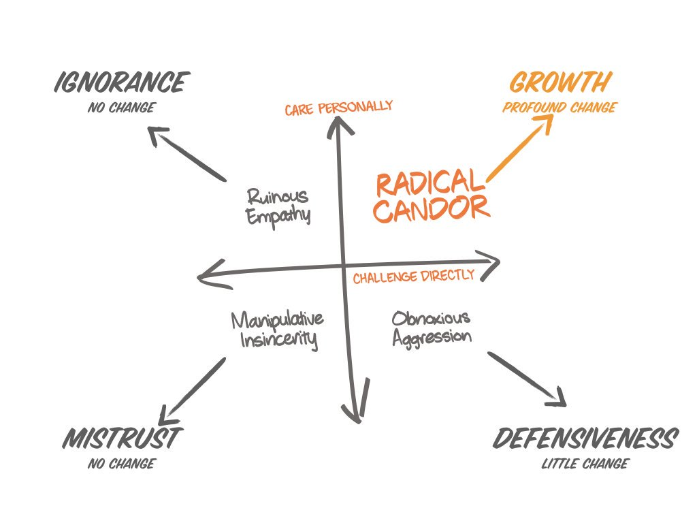
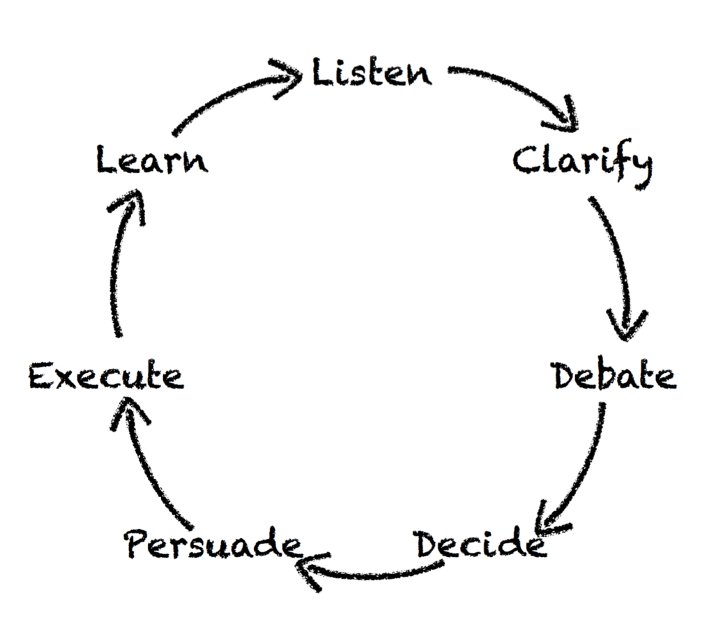

# Radical Candor: Be a Kick-Ass Boss without Losing Your Humanity
{: .no_toc }

  

    Table of contents
  

1. TOC
{:toc}

## Chapter 1: Build Radically Candid Relationships
> We undervalue the "emotional labor" of being the boss" (4)

**Bosses guide a team to achieve results.**

Three areas of responsibility for a boss:
1. **guidance** - often referred to as _feedback_
2. **team-building** - ensure you have a team of rockstars and superstars
3. **results** - teams getting things done

Radical Candor Matrix:

There are two dimensions to Radical Candor:
1. **Care Personally**:
> To have a good relationship, you have to be your whole self and care about each of the people who work for you as a human being. It's not just business; it is personal, and _deeply_ personal. (9)
>
> There are a few things more damaging to human relationships than a sense of superiority. (12)
>
> Only when you actually care about the _whole person with your whole self_ can you build a relationship. (13)

1. **Challenge Directly**:
> [...] delivering hard feedback, making hard calls about who does what on a team, and holding a high bar for results (9)

You don't need to say every unimportant thing: a good rule of thumb is to leave three unimportant things unsaid each day (16)

> [Radical Candor] gets measured at the listener's ear, not at the speaker's mouth. (16)

## Chapter 2: Get, Give, And Encourage Guidance
There are two dimensions to good guidance: care personally and challenge directly.

### Obnoxious Aggression
{: .no_toc }
If you criticize someone without showing you care, it feels obnoxiously aggressive to the recipient. If you can't be radically candid with someone, you can at least be obnoxiously aggressive, so at least people know where you stand. Most people prefer the challenging "jerk" to the boss whose "niceness" gets in the way of candor.

> It's not mean, it's clear! (25)

- **front-stabbing** - belittling in public.
- **belittling compliments** - praise that is belittling

### Manipulative Insincerity
{: .no_toc }
What happens when you don't care enough about a person to challenge directly. Normally results in empty praise and ignoring of problems, or even praise of problems.

- **false apology** - agreeing with a person just to remove tension

### Ruinous Empathy
{: .no_toc }
Responsible for the vast majority of managerial mistakes. An effort to avoid tension and discomfort.

- **just trying to say something nice** - trying to find an excuse to give praise when praise might need to be distributed or might not be merited.

> when giving praise, investigate until you really understand who did what and why it was so great. Be as specific and thorough with praise as with criticism. Go deep into the details. (33)

> If a person is bold enough to criticize you, do _not_ critique their criticism. If you see somebody criticize a peer inappropriately, say something. But if somebody criticizes _you_ inappropriately, it's your job is to listen with the intent to understand and then reward the candor. (34)

Balance praise and criticism -- worry more about praise, less about criticism, but above all be sincere.

## Chapter 3: Understand What Motivates Each Person on your Team

Teams are made up of rockstars and superstars. Rockstars want to excel in their niche while superstars need new challenges and opportunities to grow constantly.

| steep growth trajectory | gradual growth trajectory |
| - | - |
| change agent | force for stability |
| ambitious at work | ambitious outside of work or simply content in life |
|want new opportunities | happy in the current role |
| "superstar" | "rockstar" |

shift from talent management to growth management, with "growth" substituting for "potential", as "low potential" demonizes the rockstars who are essential for stability.

> The most important thing you can do for your team collectively is to understand what growth trajectory each person wants to be on at a given time and whether that matches the needs and opportunities of the team. (48)

Growth Trajectory:

The idea of getting people who are "passionate" for their jobs is misguided, as people are motivated for different reasons.

> [...] your job is not to provide purpose but instead to get to know each of your direct reports well enough to understand how each on derives meaning from their work. (51)

### Excellent Performance
{: .no_toc }

You should keep your top performers top of mind, and spend the majority of time making sure they continue to do good work. You want to be a "partner", to make sure people doing the best work can overcome obstacles. You need to understand the details of their work, to roll up the sleeves.

#### excellent performance/gradual growth trajectory
{: .no_toc }

- recognize, reward, but don't promote.
**fair performance ratings** - sometimes rockstars don't get the performance ratings they deserve, so ensure that this isn't the case
**recognition** - designate as "gurus" or "go-to" experts
**respect** - retain individuals who keep team stable, cohesive, and productive

"up or out" policy harmful for these individuals

#### excellent performance/steep growth trajectory
{: .no_toc }
keep superstars challenged (and figure out who will replace them when they move on), don't squash or block them, and recognize that not every superstar wants to manage.

### Poor Performance
{: .no_toc }

#### poor performance/negative growth trajectory
{: .no_toc }

For these individuals, you should part ways. Managers typically wait too long to fire someone, so you can ask three questions to determine if the time is right to fire someone:
1. _Have you given Radically Candid guidance?_ - have you been humble and direct in your criticism?
2. _How is this person's poor performance affecting the rest of the team?_ - does it affect peers?
3. _Have you sought out a second opinion, spoken to someone whom you trust and with whom you can talk the problem through?_ - seek a different perspective

**Common lies managers tell themselves to avoid firing someone**
1. _It will get better_
2. _Somebody is better than nobody_
3. _A transfer is the answer_
4. _It's bad for morale_

When firing someone, it might help to recall a job you were not well suited for and the relief you experienced when you no longer had to do that job.

#### poor performance/steep growth trajectory
{: .no_toc }
There are a few reasons someone might not be suited for a role but might still be an asset:
- wrong role
- new to role: too much, too fast
- personal problems (outside of work)
- poor fit

Important to understand some might switch from rockstar to superstar and back again, so one label isn't forever.

## Chapter 4: Drive Results Collaboratively

Drive Results Collaboratively:

