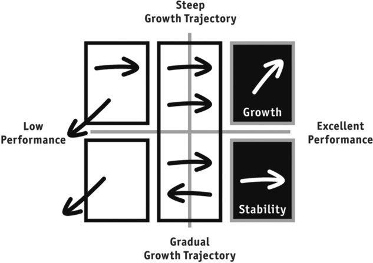

# Radical Candor: Be a Kick-Ass Boss without Losing Your Humanity
{: .no_toc }

  

    Table of contents
  

1. TOC
{:toc}

## Chapter 1: Build Radically Candid Relationships
> We undervalue the "emotional labor" of being the boss" (4)

**Bosses guide a team to achieve results.**

Three areas of responsibility for a boss:
1. **guidance** - often referred to as _feedback_
2. **team-building** - ensure you have a team of rockstars and superstars
3. **results** - teams getting things done

Radical Candor Matrix:

There are two dimensions to Radical Candor:
1. **Care Personally**:
> To have a good relationship, you have to be your whole self and care about each of the people who work for you as a human being. It's not just business; it is personal, and _deeply_ personal. (9)

> There are a few things more damaging to human relationships than a sense of superiority. (12)

> Only when you actually care about the _whole person with your whole self_ can you build a relationship. (13)

2. **Challenge Directly**:
> [...] delivering hard feedback, making hard calls about who does what on a team, and holding a high bar for results (9)

You don't need to say every unimportant thing: a good rule of thumb is to leave three unimportant things unsaid each day (16)

> [Radical Candor] gets measured at the listener's ear, not at the speaker's mouth. (16)

## Chapter 2: Get, Give, And Encourage Guidance
There are two dimensions to good guidance: care personally and challenge directly.

### Obnoxious Aggression
{: .no_toc }
If you criticize someone without showing you care, it feels obnoxiously aggressive to the recipient. If you can't be radically candid with someone, you can at least be obnoxiously aggressive, so at least people know where you stand. Most people prefer the challenging "jerk" to the boss whose "niceness" gets in the way of candor.

> It's not mean, it's clear! (25)

- **front-stabbing** - belittling in public.
- **belittling compliments** - praise that is belittling

### Manipulative Insincerity
{: .no_toc }
What happens when you don't care enough about a person to challenge directly. Normally results in empty praise and ignoring of problems, or even praise of problems.

- **false apology** - agreeing with a person just to remove tension

### Ruinous Empathy
{: .no_toc }
Responsible for the vast majority of managerial mistakes. An effort to avoid tension and discomfort.

- **just trying to say something nice** - trying to find an excuse to give praise when praise might need to be distributed or might not be merited.

> when giving praise, investigate until you really understand who did what and why it was so great. Be as specific and thorough with praise as with criticism. Go deep into the details. (33)

> If a person is bold enough to criticize you, do _not_ critique their criticism. If you see somebody criticize a peer inappropriately, say something. But if somebody criticizes _you_ inappropriately, it's your job is to listen with the intent to understand and then reward the candor. (34)

Balance praise and criticism -- worry more about praise, less about criticism, but above all be sincere.

## Chapter 3: Understand What Motivates Each Person on your Team

Teams are made up of rockstars and superstars. Rockstars want to excel in their niche while superstars need new challenges and opportunities to grow constantly.

| steep growth trajectory | gradual growth trajectory |
| - | - |
| change agent | force for stability |
| ambitious at work | ambitious outside of work or simply content in life |
|want new opportunities | happy in the current role |
| "superstar" | "rockstar" |

shift from talent management to growth management, with "growth" substituting for "potential", as "low potential" demonizes the rockstars who are essential for stability.

> The most important thing you can do for your team collectively is to understand what growth trajectory each person wants to be on at a given time and whether that matches the needs and opportunities of the team. (48)

Growth Trajectory:

The idea of getting people who are "passionate" for their jobs is misguided, as people are motivated for different reasons.

> [...] your job is not to provide purpose but instead to get to know each of your direct reports well enough to understand how each on derives meaning from their work. (51)

### Excellent Performance
{: .no_toc }

You should keep your top performers top of mind, and spend the majority of time making sure they continue to do good work. You want to be a "partner", to make sure people doing the best work can overcome obstacles. You need to understand the details of their work, to roll up the sleeves.

#### excellent performance/gradual growth trajectory
{: .no_toc }

- recognize, reward, but don't promote.
**fair performance ratings** - sometimes rockstars don't get the performance ratings they deserve, so ensure that this isn't the case
**recognition** - designate as "gurus" or "go-to" experts
**respect** - retain individuals who keep team stable, cohesive, and productive

"up or out" policy harmful for these individuals

#### excellent performance/steep growth trajectory
{: .no_toc }
keep superstars challenged (and figure out who will replace them when they move on), don't squash or block them, and recognize that not every superstar wants to manage.

### Poor Performance
{: .no_toc }

#### poor performance/negative growth trajectory
{: .no_toc }

For these individuals, you should part ways. Managers typically wait too long to fire someone, so you can ask three questions to determine if the time is right to fire someone:
1. _Have you given Radically Candid guidance?_ - have you been humble and direct in your criticism?
2. _How is this person's poor performance affecting the rest of the team?_ - does it affect peers?
3. _Have you sought out a second opinion, spoken to someone whom you trust and with whom you can talk the problem through?_ - seek a different perspective

**Common lies managers tell themselves to avoid firing someone**
1. _It will get better_
2. _Somebody is better than nobody_
3. _A transfer is the answer_
4. _It's bad for morale_

When firing someone, it might help to recall a job you were not well suited for and the relief you experienced when you no longer had to do that job.

#### poor performance/steep growth trajectory
{: .no_toc }
There are a few reasons someone might not be suited for a role but might still be an asset:
- wrong role
- new to role: too much, too fast
- personal problems (outside of work)
- poor fit

Important to understand some might switch from rockstar to superstar and back again, so one label isn't forever.

## Chapter 4: Drive Results Collaboratively

Get Stuff Done (GSD) wheel:

### Listen
{: .no_toc }
Ensure that everyone is heard; give the quiet ones a voice.

**quiet listening** - not giving your opinion vehemently; comfortable with the silences
**loud listening** - put a strong view on things but insist on a response; "strong opinions, weakly held"

You want to create a culture of listening:
1. have a simple system for employees to use to generate ideas and voice complaints
2. make sure that at least some of the issues raised are quickly addressed
3. regularly offer explanations as you why other issues aren't being addressed

### Clarify
{: .no_toc }
> As the boss, you are the editor, not the author. (89)

Push to understand and convey thoughts and ideas more clearly. It's important to be clear in your own mind before you can explain to others, and that might involve nurturing ideas in a smaller 1:1 environment.

### Debate
{: .no_toc }
The point of spending all the time in clarifying mode is to get an idea ready for debate (the rock tumbler of ideas). You need to ensure there is a culture of debate on the team.

Keep the conversation focused on ideas, not egos. Egos have a way of corrupting ideas and argument, twisting it to _ad hominem_.

Also, important for folks to dissent, not just all agree.

Use humor and have fun.

**Set a clear "decide-by" date.** to prevent argument from dragging out.

### Decide
{: .no_toc }
Typically, as boss you are not the "decider". The decider should be the one with the best information, not the highest paid person's opinion' (HiPPO). You want to empower people who are closest to the facts to make as many decisions as possible.

Decider should get facts, not recommendations (which tend to be imbued with ego)

Important to go to source of information and not have that info filtered through several managers (the person doing the job)

### Persuade
{: .no_toc }

You can use Aristotle's ideas of persuasion in _Rhetoric_:
1. **pathos** (emotion) - the listener's emotions, not the speakers
2. **logos** (logic) - demonstrate expertise and humility
3. **ethos** (credibility) - show your work

### Execute
{: .no_toc }
- minimize the collaboration tax
- don't waste your team's time - make sure you clear obstacles for team's time
- keep the "dirt under your fingernails" - integrate executing directly into your daily work so you stay sharp

### Learn
{: .no_toc }
You need to learn from your previous actions, either as successes or failures.

> denial is actually the more common reaction to imperfect execution than learning. (108)

## Chapter 5: Relationships
> You can't give a damn about others if you don't take care of yourself. (115)

> Don’t think of work-life balance, as some kind of zero-sum game where anything you put into your work robs your life and anything you put into your life robs your work. Instead, think of it as a work-life integration.

One of the most important aspects is relinquishing unilateral authority so you can build trusting relationships. This isn't abdication or anarchy, but rather, building a relationship based on trust so people feel free at work.

When organizing a social event, even non-mandatory events can feel mandatory.

> You need to respect other people's values when they do share them with you. (122)

Exercise the platinum rule, which says that you should figure out what makes the other person comfortable and do that.

Recognize your own emotions and be open and honest about them ("I'm having a bad day, and I'm trying not to be grouchy but I apologize if I slip")

- Acknowledge emotions
- Ask questions
- Don’t add your guilt
- Don’t tell them how to feel
- If you can’t handle emotional outbursts, excuse yourself
- Keep tissues a short walk away (allows them to compose themselves)
- Have bottled water (the simple act of unscrewing the bottle and drinking, often gives enough time to regain composure)
- Walk, don’t sit — walking in the same direction helps with difficult situations

## Chapter 6: Guidance
In order to build a culture of radical candor you need to _get_, _give_, and _encourage_ both praise and criticism.

### Solicit Impromptu Guidance
{: .no_toc }
You as the boss are the exception to the criticize in private adage. You should encourage teams to criticize in public, which leads to the message that "everyone should embrace criticism that helps us do our jobs better". Don't fear public challenges as a challenge to your authority -- in fact, it helps establish credibility.

A helpful question might be "What could I do or stop doing that would make it easier to work with me"

Embrace the discomfort, and listen with the intent to understand, not to respond. You can try saying "So What I hear you saying is..."

Reward criticism to get more of it.

> Employees won't feel free if you don't take specific actions to ensure that its not just safe but expected to make suggestions and complaints. (135)

Management fix it weeks, might work like bug bashes but for management tickets (a board, voting on solutions, etc.)

### Give Impromptu Guidance
{: .no_toc }

Be humble -- a helpful paradigm can be the **situation**, **behavior**, **impact**. Outline a **situation**, describe the **behavior**, good or bad, and identify the **impact**. e.g., "I've been waiting for that spot for five minutes (situation) and you just zipped in front of me (behavior) and now I'm going to be late (impact).

Separate what you think from what you said, and see if what you thought impinged on what you said.

- Ontological Humility - separate subjective experience from objective reality
- be helpful
- state intentions to lower defenses
- show, don't tell
- finding help is better than offering it yourself
- guidance is a gift, not a whip or a carrot

Additionally, you should try and give feedback immediately, before it is lost in the haze of time when you might forget the situation or behavior. If you can, say it in person (perhaps between meetings). Don't save it up for performance reviews, or for the perfect opportunity.

> Praise in public, criticize in private. (145)

Don't personalize your criticism, don't use the "fundamental attribution error" - he is dumb therefore his idea is dumb. **You might swap "you're wrong" with "that's wrong".**

### Being Radically Candid with your boss
{: .no_toc }
Can use the paradigm of **Listen, Challenge, Commit** to voice disagreement, then pivot to executing if your boss doesn't change their mind. A strong leader has the humility to listen, the confidence to challenge, and the wisdom to know when to quit arguing and get on board.

Slowly introduce the concept of radical candor, and if your boss doesn't seem receptive to it after a few efforts, it might be time to find a new job.

### Gender and Guidance
{: .no_toc }
Might be harder for men managing women, as there is a punches pulled effect. Gender politics might also get in the way of honest and open communication.

Radical candor might be harder for women; might be construed as 'abrasive' or 'shrill', or as a 'likeability' concern.

For men, don't pull punches.

For women, demand criticism.

For men and women, when you think a women is being 'too aggressive':
- switch gender roles
- be more specific
- don't use gendered language
- never just say 'be more likeable'

If you are a women who is told you are abrasive:
- never stop challenging directly (often, women back off, which harms their careers)
- care personally, but kill the "angel in the office" (paving over the gap with doing office chores")
- the competence/likeability has not concluded that you weren't out of line
- don't kick up and kiss down
- don't write men off

Skip level meetings are a good way to understand how your direct reports are managing. You set up a meeting with your direct reports direct reports to understand how they might be managing, to solicit honest feedback.

## Chapter 7: Team