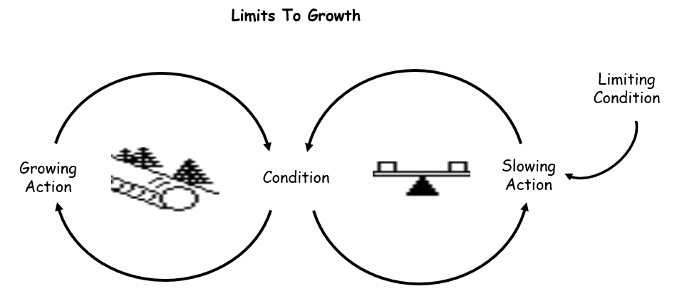
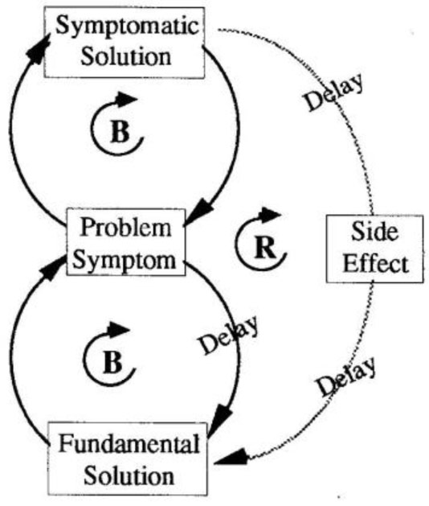

# The Fifth Discipline: The Art & Practice of The Learning Organization

{: .no_toc }

  

    Table of contents
  

1. TOC
{:toc}

# Chapter 1

> The tools and ideas presented in this book are for destroying the illusion that the world is created of separate, unrelated forces. (3)

> The organizations that will truly excel in the future will be the organizations that discover how to tap people's commitment and capacity to learn at all levels in an organization. (4)

- work has shifted from material to intrinsic value and thus we view work as a social institution
- Five Disciplines:
  - **systems thinking** - everything that happens is likely part of a system -- "we tend to focus on snapshots of isolated parts of the system, and wonder why our deepest problems never seem to get solved." (8)
  - **personal mastery** - "the discipline of continually clarifying and deepening our personal vision, of focusing our energies, of developing patience, and of seeing reality objectively."
  - **mental models** - the pictures or heuristics we use to understand the world -- "deeply ingrained assumptions, generalizations, or even pictures or images that influence how we understand the world and how we take action"
  - **shared vision** - building a vision of the shared future we create
  - **team learning** - teams can be more than the sum of their parts by learning -- "When teams are truly learning, not only are they producing extraordinary results but the individual members are growing more rapidly than could have occurred otherwise."
- the fifth discipline is systems thinking -- all other disciplines are fed by it
- **metanoia** - shift of mind, which underpins how we view "real" learning, as opposed to the common view of learning, which is taking in info
- business gives you freedom to experiment and since earnings present an objective and quantifiable result, you can ostensibly test your experiments

# Chapter 2 - Learning Disabilities

## Learning Disabilities of Organizations

1. _I am my position_

- when you see your identity as your role, your view of responsibilities ends at your position

2. _The enemy is out there_

- an offshoot of _I am my position_ -- you always perceive fault as outside one's own context/boundaries

3. _The illusion of taking charge_

- often proactiveness is reactiveness in disguise, especially if it is other-directed (reacting to market, customer complaint, etc.)
- true proactiveness is inward-directed (how do we create our own problems)

4. _Fixation on events_

- we are conditioned to view everything as a series of events, each with a single cause, but change is a slow process and the causes are often cyclical

5. _The parable of the boiled frog_

- we tend not to notice slow, gradual change
- "Learning to see slow, gradual processes requires slowing down our frenetic pace and paying attention to the subtle as well as the dramatic." (25)

6. _The delusion of learning from experience_

- " we learn best from experience but we never directly experience the consequences of many of our most important decisions." (25)

7. _The myth of the management team_

- Management team is adapt at avoiding real learning or accountability, "skilled incompetence" as Argyris calls it

# Chapter 3 - The Beer Game

- the beer game can be played to demonstrate how a lack of systems thinking can lead to disastrous results

**setup**:

- you have a retailer, wholesaler, and brewery, and they don't talk to each other. Customer demand increases on the retailer, and this causes ballooning and cascading demand to cripple the entire supply chain as retailer overreacts to shipment delays, and on down

3 important lessons to the beer game:

1. **Structure influence behavior**

- when different people are placed in the same system, they tend to produce the same results
- the system causes its own behavior

1. **Structure in human systems is subtle**

- we often have the power to alter the structure of the system we are operating in
- need someone to blame when there are problems, first one another, then the customer, then the system itself

2. **Leverage often comes from new ways of thinking**

- need to understand how your position fits within the system
- in order to succeed, others must succeed

Types of Explanations

1. Systemic Structure (generative)

- structure produces behavior, so changing structure changes behavior
- "redesigning our own decision making redesigns the system structure." (53)

2. Patterns of Behavior (responsive)

- seeing long-term trends and focusing on their implications

3. Events (reactive)

- simple cause and effect
- easiest to do but least beneficial

# Chapter 4 - Laws of the Fifth Discipline

## Laws of the Fifth Discipline

1. Today's problems come from yesterday's solutions

- solutions that merely shift problem to another part of the system go undetected

2. The harder you push, the harder the system pushes back

- lay of compensating feedback

3. behavior grows better before it grows worse

- the dominoes will eventually fall

4. The easy way usually leads back in

- "Pushing harder and harder on familiar solutions, while fundamental problems persist or worsen, is a reliable indicator of nonsystemic thinking—what we often call the "what we need here is a bigger hammer" syndrome." (61)

5. The cure can be worse than the disease

- shifting the burden to the intervenor

6. Faster is slower
7. Cause and effect are not closely related in time and space
8. small changes can lead to big results, but areas of highest leverage are often the least obvious

- "small, well-focused actions can sometimes produce significant, enduring improvements, if they're in the right place. Systems thinkers refer to this principle as "leverage." (64)

9. You can have your cake and eat it too, but not at once

- problems might be improperly stated as "either-or" but both can be improved over the long-term

10. Dividing an elephant in half does not produce two elephants

- often the whole needs to be examined instead of component parts

11. There is no blame

- everything is part of the same system, there is no "other"

# Chapter 5 - Shift of Mind

- systems thinking is the discipline for seeing the structures that underlie complex situations and for discerning high from low leverage

**2 types of complexity**

1. detail complexity: lots of variables
2. dynamic complexity: effects over time of intervention are not obvious

- essence of systems thinking is a shift of mind (metanoia)
  - seeing interrelationships, not linear cause and effect
  - seeing processes of change instead of snapshots
- English language, in subject-verb-object construction, is biased towards cause and effect thinking, but in a system every influence is both a cause and effect
- need to think in circles, understanding feedback and how it "builds to learning to recognize types of "structures" that recur again and again" (73)
- human actor is not separate from the feedback process but part of it
- **delays** are interruptions in time between two influences corresponding

**2 types of feedback processes**

1. reinforcing (amplifying)

- engines of growth or decline
- vicious or virtuous cycles

2. balancing (stabilizing)

- operates where there is goal-oriented behavior seeking stability
- to understand you must know both the explicit as well as the implicit goals
- more difficult to see because nothing might appear to be happening, maintains the status quo
- resistance to change almost always arises from threats to traditional norms and ways of doing things

# Chapter 6 - System Patterns

- patterns of structures recur again and again
- not enough to just recognize these structures, we must change the underlying thinking that produces the problem

## Limits to Growth

- an amplifying process that leads to an inadvertent second loop that limits growth
- need to address balancing loop, not reinforcing loop
- very often a cultural change
- **KEY**: don't push growth, remove factors limiting growth

- **EXAMPLES**: new sales increase revenue, but increase the need for more senior engineers to manage and thus reducing the senior engineer pool to deliver on products, leading to delays in product delivery and reduced sales

## Shifting the Burden

- an underlying problem creates symptoms that demand attention, but the underlying problem is hard to address, so a solution that handles the symptoms is implemented, leaving the underlying problem to fester and grow
- a special case of shifting the burden is _Eroding Goals_
  - whenever there is a gap between performance and goals, two pressures exists -> 1) improve the situation 2) lower goals
  - need to strengthen fundamental (ideal) response (first, identify it!), and also weaken symptomatic response
- strengthening fundamental response requires long-term orientation and shared vision
- weakening the symptomatic response requires willingness to tell the truth about palliatives and "looking good" solutions
- **KEY**: Beware the symptomatic solution. In the short term it feels good to address symptoms. In the long-term, these symptoms will recur, making a symptomatic solution easier.

- **EXAMPLE** - alcohol to treat stress

# Chapter 7 - Self-Limiting or Self-Sustaining Growth

- intuition of many experienced managers that it is vital to hold critical performance goals through thick and thin, and those standards are most important that matter to the customer

## Limit Growth through Underinvestment

- build less capacity than is needed to serve customer demand
- hard to see because it is gradual and managers prioritize other problems
- systems thinking is important to organize detail complexity into a coherent story, what is important vs. what is not

# Chapter 8 - Personal Mastery

- organizations learn only through individuals that learn

## Personal Mastery

- discipline of growth and learning
  two underlying movements

1. clarifying what is important to us
2. continually learning how to see the current reality more clearly

- **creative tension** between what we want and where we are relative to what we want, and this drives learning
- learning doesn't mean acquiring info, but ability to produce results we truly want in life
- continual learning mode -- never arrive
- "People with a high level of personal mastery are acutely aware of their ignorance, their incompetence, their growth areas. And they are deeply self-confident." (133)
- resistance to learning might come from
  - those who think the idea is "soft" or unquantifiable
  - cynics -- those who mistook ideals for expectations, _i.e.,_ frustrated idealists

### Discipline of Personal Mastery

**personal vision**

- "The ability to focus on ultimate intrinsic desires, not only on secondary goals, is a cornerstone of personal mastery." (137)
- sometimes expressed as "genuine caring"
- "But vision is different from purpose. Purpose is similar to a direction, a general heading. Vision is a specific destination, a picture of a desired future. Purpose is abstract. Vision is concrete. Purpose is "advancing man's capability to explore the heavens." Vision is 'a man on the moon by the end of the 1960s.' Purpose is 'being the best I can be,' 'excellence.' Vision is breaking four minutes in the mile." (138)

**creative tension**

- gap between vision and current reality
- not to be confused with being in a state of anxiety, which is _emotional tension_
- it is not what vision is, it's what it does, how it leads to growth
- "Failure is, simply, a shortfall, evidence of the gap between vision and current reality. Failure is an opportunity for learning" (143)

**structural conflict**

- most of us hold one of two contradictory beliefs

1. our powerlessness to bring our world into being
2. our unworthiness of the endeavor

- this leads to 3 coping strategies

1. letting vision erode
2. conflict manipulation - creating a conflict to incite additional effort
3. will power - bulldoze through by sheer will

- one way to overcome structural conflict is to tell the truth, "to root out the ways we limit or deceive ourselves from seeing what is, and to continually challenge our theories of why things are the way they are" (148)

**using the subconscious**

- use the automatic mind to achieve vision
- focus on the desired result itself by asking "what would it get me?"
- "what matters most is the visible behavior of people in leadership positions in sharing their own personal visions and demonstrating their commitment to the truth." (155)

systems perspective illuminates personal mastery by

1. integrating reason and intuition -- giving managers who rely on intuition a language to express that intuition reasonably
2. connectedness to the world - "to continually expand our awareness and understanding, to see more and more of the interdependencies between actions and our reality, to see more and more of our connectedness to the world around us." (160)
3. compassion and empathy
4. commitment to the whole - "work relentlessly to foster a climate in which the principles of personal mastery are practiced in daily life" (162)

# Chapter 9 - Mental Models

- mental modesl are active -- they shape how we act
- they are the images, assumptions, and stories we carry in our heads, and they affect what we see
- all models are simplifications, the problems arise when they become implicit -- when we are unaware of them, they impede learning

_3 facts to developing an organizations ability to surface and test mental models_

1. **tools** - that promote personal awareness and reflective skills
2. **infrastructure** - that try to institutionalize regular practice with mental models
3. **culture** that promotes inquiry and challenging our thinking

_2 important values for overcoming the toxic hierarchical thinking_

1. openness (honesty)
2. merit (making the decision that is best for the organization)

- also important are skills of reflection and skills of inquiry: "Skills of reflection concern slowing down our own thinking processes so that we can become more/aware of how we form our mental models and the ways they influence our actions. Inquiry skills concern how we operate in face-to-face (interactions with others, especially in dealing with complex and conflictual issues." (175)

## Tools of the Discipline of Mental Models

**reflective practice**

- bringing key assumptions about important business issues to the surface
**espoused theory vs theory-in-use**
- using gaps between what we say and what we do to become more aware
**leads of abstraction**
- leap to generalizations/assumptions too quickly to allow learning
- bad because those leaps become axiomatic
- until we are aware of leaps in abstraction we aren't aware of need for inquiry
**left-hand column**
- right-hand side, write an exchange, and on the left, write what you were thinking but not saying
- brings hidden assumptions forward
**balancing inquiry and advocacy**
- aka reciprocal inquiry
- everyone makes thinking explicit and subject to public examination

_When advocating your view:_
- Make your own reasoning explicit (i.e., say how you arrived at your view and the "data" upon which it is based)
- Encourage others to explore your view (e.g., "Do you see gaps in my reasoning?")
- Encourage others to provide different views (i.e., "Do you have either different data or different conclusions, or both?")
- Actively inquire into others' views that differ from your own (i.e., "What are your views?" "How did you arrive at your view?" "Are you taking into account data that are different from what I have considered?")

_When inquiring into others' views:_
- If you are making assumptions about others' views, state your assumptions clearly and acknowledge that they are assumptions
- State the "data" upon which your assumptions are based
- Don't bother asking questions if you're not genuinely interested in the others' response (i.e., if you're only trying to be polite or to show the others up)

_When you arrive at an impasse (others no longer appear to be open to inquiring into their own views):_
- Ask what data or logic might change their views.
- Ask if there is any way you might together design an experiment (or some other inquiry) that might provide new information

_When you or others are hesitant to express your views or to experiment with alternative ideas:_
- Encourage them (or you) to think out loud about what might be making it difficult (i.e., "What is it about this situation, and about me or others, that is making open exchange difficult?")
- If there is mutual desire to do so, design with others ways of overcoming these barriers

# Chapter 10 - Shared Vision
- shared vision is not an idea (although might be inspired by one) but a force of impressive power in people's hearts
- answers the question "what do we want to create"
- shared vision provides the focus and energy for learning
- can be extrinsic (outward focused) or intrinsic, with intrinsic shared vision often more effective
- their company becomes our company, people work together and share a common identity
- "Without a pull toward some goal which people truly want to achieve, the forces in support of the status quo can be overwhelming." (195)
- without a shared vision, it might be impossible to convince humans to take the long view
- shared visions emerge from personal visions
- you can't compel people to your vision -- if you try and force it you will only get compliance and not commitment

need to give up the notion that shared vision needs to be created from on high, which is bad for 3 reasons:
1. that vision is sinlge effort at providing overarching direction and meaning to the firm's strategy
2. that vision does not build on personal vision
3. that vision is not a solution to a problem

### possible attitudes toward a vision
1. **Apathy** - *Neither for nor against vision. No interest. No energy. "Is it five o'clock yet?"*
2. **Non-Compliance** - *Does not see benefits of vision and will not do what's expected. "I won't do it; you can't make me."*
3. **Grudging Compliance** - *Does not see the benefits of the vision. But, also, does not want to lose job. Does enough of what's expected because he has to, but also lets it be known that he is not really on board.*
4. **Formal Compliance** - *On the whole, sees the benefits of the vi sion. Does what's expected and no more. "Pretty good soldier." *
5. **Genuine Compliance** - *Sees the benefits of the vision. Does everything expected and more. Follows the "letter of the law." "Good soldiers."*
6. **Enrollment** - *Wants it. Will do whatever can be done within the "spirit of the law."*
7. **Commitment** - *Wants it. Will make it happen. Creates whatever "laws" (structures) are needed.*

- vision is the what, purpose is the why
- core values answer how we want to act
- "There are two fundamental sources of energy that can motivate organizations: fear and aspiration. The power of fear underlies negative visions. The power of aspiration drives positive visions." (209)

# Chapter 11 - Team Learning
- goal of a team is "alignment", or when a group of people function as a whole
- "The fundamental characteristic of the relatively unaligned team is wasted energy [...] There is a commonality of purpose, a shared vision, and understanding of how to complement one another's efforts." (217)
- "Team learning is the process of aligning and developing the capacity of a team to create the results its members truly desire" (218)

Team learning has three critical dimensions
1. a need to think insightfully about complex issues
2. a need for innovative, coordinated action
3. the role of team members on other teams, i.e., a learning team continually fosters other learning teams through inculcating practices and skills of team learning more broadly

- need to master the practices of dialog and discussion
two primary types of discourse
**dialogue**
-  a free and creative exploration of complex issues
-  deep listening
-  suspending one's own views
-  "the purpose of dialog is to reveal the incoherence in our thought"
**discussion**
- different views are presented and defended
- search for the best view to support decisions that must be made

three basic conditions necessary for dialogue
1. suspend assumptions
  - must be aware of our assumptions and hold them up for examination
  - this is similar to "leaps of abstraction" and "inquiring into reason for abstraction" with mental models
2. regard one another as colleagues
  - necessary for a willingness to treat others as colleagues
  - hierarchy is antithetical to dialog, so individuals must want the benefits of dialogue more than the privileges of rank
3. a facilitator must hold the context of the conversation
  - moves the conversation along and resists the urge for dialogue to become discussion (pushing for decisions)
  - also capable of framing counter views and participating in the dialogue

- discipline of team learning requires practice, and a continual movement between practice and performance
- thought is participative, and collectively we can be more insightful and intelligent than we can be individually
- a reliable indicator a team is learning is visible conflict of ideas
- difference between great and mediocre teams is how they face conflict and deal with defensiveness that arises

### Defensive Routines
- entrenched habits we use to protect ourselves from embarrassment and threat that occurs when we expose our thinking
- response to a problem, and obscure their own existence
- the most effective defensive routines are those we cannot see
- managers internalize an idea that they must know what's going on, which leads to two problems:
  1. close themselves to alternative realities and make themselves uninfluenceable
  2. maintain air of confidence by obscuring ignorance
- leverage in reducing them, like all shifting the burden structures, lies in:
  - weakening symptomatic solution
  - strengthening fundamental solution
- need to confront defensiveness without producing more defensiveness, and we need a ruthless commitment to telling the truth about our current reality
- the stronger the defensiveness the more important the issue

- an essential principle of practice is experimentation in a "virtual world"
- dialogue sessions allow a team to come together and practice, basic conditions are:
  1. having all members of team together
  2. explaining the ground rules of dialogue
  3. enforcing those ground rules, and if anyone is unable to suspend assumptions, you acknowledge you are discussing and not dialoguing
  4. encouraging team members to raise the most difficult issues

- "Perhaps the single greatest liability of management teams is that they confront these complex, dynamic realities with a language designed for simple, static problems" (249)
- find and fix mentality leads to a stream of short term fixes
- need a better language for describing complexity beyond linear cause and effect -- systems thinking is that language
