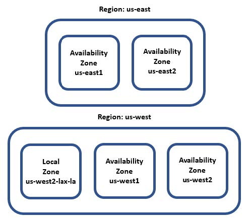
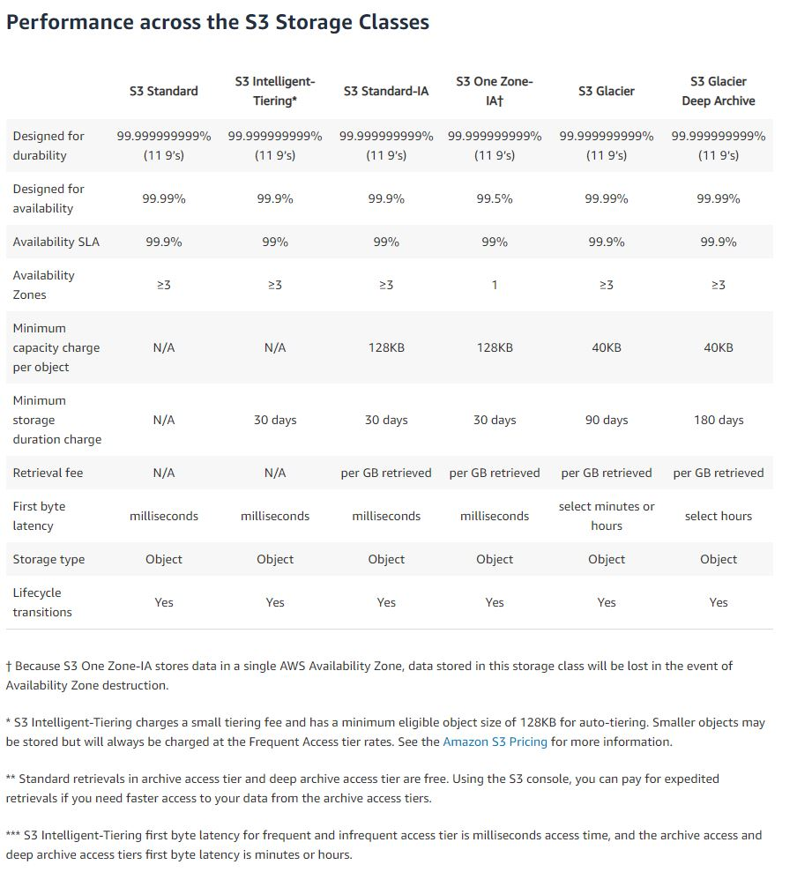
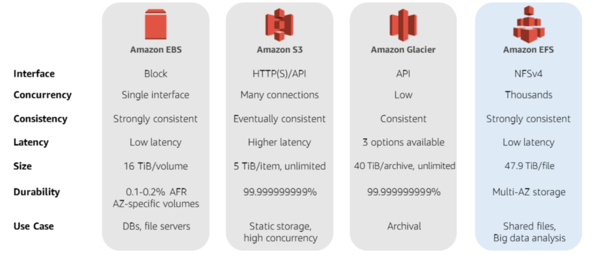
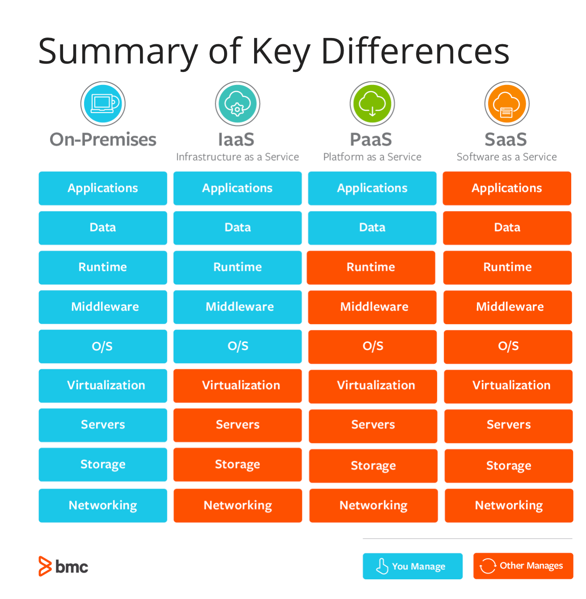

# AWS for Solution Architects
{: .no_toc }

  

    Table of contents
  

1. TOC
{:toc}

# 1: Understanding AWS Cloud Principles and Key Characteristics
The cloud is just a bunch of servers and other computing resources managed by a third-party provider in a data center somewhere

## Cloud Elasticity
{: .no_toc }
One important characteristic of the leading cloud providers is the ability to quickly and frictionlessly provision resources. In a cloud environment, instead of needing potentially months to provision your servers, they can be provisioned in minutes.

Another powerful characteristic of a cloud computing environment is the ability to quickly shut down resources and, importantly, not be charged for that resource while it is down.

**elasticity** is the ability of a computing environment to adapt to changes in workload by automatically provisioning or shutting down computing resources to match the capacity needed by the current workload.

## Cloud Virtualization
{: .no_toc }
**Virtualization** is the process of running multiple virtual instances on top of a physical computer system using an abstract layer sitting on top of actual hardware.

A **hypervisor** is a computing layer that enables multiple operating systems to execute in the same physical compute resource. These operating systems running on top of these hypervisors are **Virtual Machines** (VMs).

## Definition of the Cloud
{: .no_toc }
The **cloud computing** model is one that offers computing services such as compute, storage, databases, networking, software, machine learning, and analytics over the internet and on demand. You generally only pay for the time and services you use.

## The Five Pillars of a Well-Architected Framework
{: .no_toc }

### Pillar 1: Security
{: .no_toc }
- Always enable traceability.
- Apply security at all levels.
- Implement the principle of least privilege.
- Secure the system at all levels: application, data, operating system, and hardware.
- Automate security best practices

### Pillar 2: Reliability
{: .no_toc }
- Continuously test backup and recovery processes.
- Design systems so that they can automatically recover from a single component failure.
- Leverage horizontal scalability whenever possible to enhance overall system availability.
- Use automation to provision and shutdown resources depending on traffic and usage to minimize resource bottlenecks.
- Manage change with automation.

### Pillar 3: Performance Efficiency
{: .no_toc }
- Democratize advanced technologies.
- Take advantage of AWS's global infrastructure to deploy your application globally with minimal cost and to provide low latency.
- Leverage serverless architectures wherever possible.
- Deploy multiple configurations to see which one delivers better performance.

### Pillar 4: Cost Optimization
{: .no_toc }
- Use a consumption model.
- Leverage economies of scale whenever possible.
- Reduce expenses by limiting the use of company-owned data centers.
- Constantly analyze and account for infrastructure expenses

### Pillar 5: Operational Excellence
{: .no_toc }
Measured across three dimensions:
1. Agility
2. Reliability
3. Performance

- Provision infrastructure through code (for example, via CloudFormation).
- Align operations and applications with business requirements and objectives.
- Change your systems by making incremental and regular changes.
- Constantly test both normal and abnormal scenarios.
- Record lessons learned from operational events and failures.
- Write down and keep standard operations procedures manual up to date.

# 2: Leveraging the Cloud for Digital Transformation
## Regions, Availability Zones, and Local Zones
AWS breaks their infrastructure down into parts:
- **AWS Regions** exist in separate geographic areas, and are made up of several isolated and independent data centers
- **Availability Zones** (AZ) are the data centers within a region
- **Local Zones** are mini AZs that provide core services that are latency sensitive

### Regions
{: .no_toc }
Regions are separate from each other and this promotes availability, fault tolerance, and stability.

Sometimes a service might not be generally available (GA) and is only in one region.

Some services are available globally and aren't region specific Simple Storage Service (S3), Identity Management Service (IAM), and other services have inter-Region fault tolerance -- e.g., RDS with read replicas

AWS has a dedicated region just for the government called AWS GovCloud.

### Availability Zones
{: .no_toc }
The same as a data center. Have multiple power sources, redundant connectivity, and redundant resources.

AZs within Regions are interconnected, which gives you fully redundant, high bandwith, low latency, scalable, encrypted, and dedicated connections.

Some services allow you to choose AZ while some are automatically assigned.

### Local Zones
{: .no_toc }
Allow low latency for select services. Like a subset of an AZ, but doesn't have all the services available in an AZ.

Use Case: Applications which require single-digit millisecond latencies to your end-users, latency-sensitive applications

### Direct Connect
{: .no_toc }
A low-level infrastructure service that enables AWS customers to set up a dedicated network connection between their on-premise facilities and AWS that allows bypassing public internet.

Does not provide encryption in transit, so a separate service (e.g., AWS Site-to-Site VPN) can be paired to encrypt data in transit.

Uses IEEE 802.1Q (I triple E eight oh two dot 1 Q) to create VLANs.

Can reduce costs when workloads require high bandwith by:
1. transfers data from on-prem to cloud, directly reducing ISP commitments
2. costs to transfer data are billed using AWS Direct Connect transfer rate rather than internet data transfer rates, which is typically lower

## Implementing a Digital Transformation Program
Moving legacy on-prem to cloud
Some questions to ask:
- should we do bare minimum, or is it an opportunity to refactor, enhance, and optimize workloads?
- should the transformation be purely technological, or should we transform business processes too?

### Rehost
{: .no_toc }
_lift and shift_
least amount of work, services are simply migrated as is, and any problems with existing applications will come along during the migration.

**Use case**: If you are confident your processes and workflows are solid and don't need to change.

### Refactor
{: .no_toc }
Not only migrating services, but changing their underlying architecture.

**Use case**: You are comfortable with current application but want to take advantage of certain cloud advantages and functionality, such as database failover.

### Revise
{: .no_toc }
Modify, optimize, and enhance existing applications and code base before migrating, then you can rehost or refactor. Good for maintaining business continuity and creating business enhancements, but sub-optimal sometimes because of cost of changing and testing code upfront.

**Use case**: If you know your applications are sub-optimal and need to be revised anyway.

### Rebuild
{: .no_toc }
Completely rewrite and rearchitect the existing applications, which will be considerable work and considerable cost, and might contribute to vendor lock-in.

**Use case**: If the most radical change is needed.

### Replace
{: .no_toc }
Get rid of applications but replace with SaaS alternatives, which may or may not be more expensive than rebuilding depending on talent pool. Learning curve and development life cycle is shortened, but software will require additional licenses.

**Use case**: If there is a commercially available software as a service available and your talent pool is short.

### Migration Assessment Tools
{: .no_toc }
- **AWS Migration Hub**: central repository to keep track of a migration project
- **AWS Application Discovery Service**: automates the discovery and inventory tracking of different infrastructure resources, such as servers, and any dependencies among them
- **AWS Migration Pattern Library**: collection of migration templates and design patterns that can assist in the comparison of migration options and
alternatives
- **CloudEndure Migration**: simplifies cloud migration by automating many of the steps necessary to migrate to the cloud
- **AWS Data Migration Service**: facilitate the migration of data from your on-premises databases to the cloud, e.g., into Amazon RDS

**Digital transformation** involves using the cloud and other advanced technology to create new or change existing business flows. It often involves changing the company culture to adapt to this new way of doing business. The end goal of digital transformation is to enhance the customer experience and to meet ever-changing business and market demand.

### Digital Transformation Tips
{: .no_toc }

1. **ask the right questions**
- how can we be doing what we do, faster and better?
- how can we change what we do to better serve our customers
- can we eliminate certain lines of business, departments, and processes
- what are the desired business outcomes when interfacing with customers
2. **get leadership buy-in**
- need buy-in from C-Suite
- can still do Proof of Concept work to prove value
3. **clearly delineate goals and objectives**
- what are you trying to achieve with migration and ruthlessly pursue that
4. **apply agile methodology to digital transformation**
- small, iterative improvement to realize value earlier, as opposed to waterfall
- look for singles, not home runs
- pick low-hanging fruit and migrate those workloads first, which will build momentum for other, harder tasks later
5. **encourage risk-taking**
- fail, but fail fast and try different things
- it is better to disrupt yourself than someone else do it
6. **clear delineation of roles and responsibilities**
- make sure all team members are aligned on their responsibilities

### Digital Transformation Pitfalls
{: .no_toc }
1. **lack of commitment from the C-Suite**
- might fail to provide vision and path to success or resources
2. **not having the right team in place**
- inexperience with cloud migration, you don't know what you don't know
3. **internal resistance from the ranks**
- people whose roles may be diminished would resist
4. **going too fast**
- moving too much at once without doing any proof of concept work
5. **going too slow**
- spending forever planning or migrating small things might make interest wane
6. **outdated rules and regulations**
- some industries are difficult to disrupt because older regulations exist, e.g., real estate requiring wet signatures

# 3: Storage in AWS
## Amazon Elastic Block Storage (EBS)
hard drive for a server, and can easily detach from one server and attach to another, and useful for persistent data, in comparison to the ephemeral data of an EC2 instance. replicated by design, so no need to set up a RAID or another redundancy strategy.

Snapshots are iterative and stored on S3. They can be compressed, mirrored, transferred across AWS AZs (by Amazon Data Lifecycle Manager). Stored as Amazon Machine Images (AMI) so they can be used to launch an EC2 instance.

using Elastic File Storage (EFS), you can attach the block storage device to multiple EC2 instances

Amazon provides 99.999% availability

- **General-purpose Solid State Devices (SSDs)**
  - solid balance of cost and performance
  - useful for virtual desktops, development and staging environments, application developmenet
- **Provisioned IOPS SSD**
  - provisioned inputs and outputs per second ideal for mission critical apps
  - business applications, production databases
- **Throughput Optimized HDD**
  - good value and reasonable cost for workloads that need high performance and high throughput
  - big data, log processing, streaming applications, data warehouse applications
- **Cold HDD**
  - optimize cost with large volumes of data
  - data the is infrequently accessed

## Amazon Elastic File System (EFS)
Implements a fully managed Network File System (NFS), and several EC2 instances can be mounted to an EFS volume at the same time.

Often used for:
- hosting content management systems
- hosting CRM applications that need to be hosted within an AWS data center but need to be managed by customer

## Simple Storage Service (S3)
Object storage, and AWS's second oldest product, right after EC2. Time To First Byte (TTFB) used to measure performance of a service.

### Comparison of Storage
{: .no_toc}

### Enhancing S3 performance
{: .no_toc}
You should be cognizant of where users are going to access content and design around that.

One way is to scale horizontally -- S3 allows as many connections to an S3 bucket as possible.

#### CloudFront
{: .no_toc}
A Content Delivery Network (CDN) that caches S3 content to be served across disperse geographic regions with thousands of Points of Presence (PoP).

#### ElastiCache
{: .no_toc}
Managed AWS service that allows you to store objects in memory rather than disk. When retrieving objects, need to check the cache first then S3.

#### Elemental MediaStore
{: .no_toc}
Supports transfer of video files.

#### S3 Transfer Acceleration
{: .no_toc}
Can achieve single-digit millisecond using CloudFront edge locations to accelerate data transfer over long distances. Useful for transferring data over AWS Regions.

[S3 best practices](https://docs.aws.amazon.com/AmazonS3/latest/userguide/security-best-practices.html)

# 4: Cloud Computing

## first computer
{: .no_toc}
- first large-scale electronic general-purpose computer the Electronic Numerical Integrator and Computer (ENIAC)
- built between 1943 and 1945
- design proposed by physicist John Mauchly

## paradigm shift
{: .no_toc}
- introduced 1962 by Thomas Kuhn in _The Structure of Scientific Revolutions_
- scientists accept predominant paradigm, but constantly challenge questioning it
- eventually new paradigm replaces the old paradigm
- e.g. heliocentric replaced geocentric view of solar system

## infrastructure as a service
{: .no_toc}
- **advantages**:
  - most flexibility
  - provisioning of computer, storage, and network resources can be done quickly
  - resources can be used for minutes, hours, or days
  - highly scalable and fault-tolerant
  - more thorough control of the infrastructure
- **disadvantages**:
  - security must be managed at all levels, and this is costly and difficult
  - legacy systems might not be able to be migrated to the cloud
  - training costs might be high to onboard new staff to the system
- **examples**:
  - Elastic Cloud Compute (EC2)
  - Elastic Block Storage (EBS)
- **use cases**:
  - backups and snapshots
  - disaster recovery
  - web hosting
  - software dev environments
  - data analytics

## platform as a service
{: .no_toc}
- **advantages**:
  - cost-effective and can use CI/CD principles
  - high availability
  - scalability
  - straightforward customization and config of app
  - reduction in dev effort and maintenance
  - security policies simplification and automation
- **disadvantages**:
  - difficult to integrate on-prem and AWS systems
  - regulations around data security might require securing data (not on third-party environment)
  - vendor lock-in (increasing scale from IaaS to PaaS to SaaS)
  - might be runtime issues because of lack of support for certain application needs
  - legacy systems might be difficult to integrate with AWS
  - can't customize some layers if needed
- **examples**:
  - Elastic Beanstalk
  - RDS
  - Lambda
  - Elastic Kubernetes Service (EKS)
- **use cases**:
  - business process management, like time clocks or company portal
  - business analytics/BI for internal data analytics
  - internet of things
  - communications applications
  - databases
  - API dev

## master data management
{: .no_toc}
- used to define and manage company's critical data, to provide single source of truth
- manages data throughout its lifecycle
- clean up data inconsistencies, duplicates, deliver to consumers

## software as a service
{: .no_toc}
- **advantages**:
  - reduce time, money, and effort on repetitive tasks
  - shift responsibility for installing, patching, configuring, and upgrading software
  - allow focus on tasks that require personal attention, such as customer service
- **disadvantages**:
  - interoperability with other services might not be straightforward
  - vendor lock-in
  - customization is very narrow
  - limited features
- **examples**:
  - WorkMail
  - WorkSpaces
  - QuickSight
  - Chime

## ec2 - general purpose
{: .no_toc}
- provides balance of compute, memory, and network resources
- can be used for variety of diverse worfklows
- ideal for apps that use compute, memory, and network resources in equal proportion, such as web servers and code repositories
- T (burstable), A (ARM chip), M (x86 dev)

## ec2 - compute optimized
{: .no_toc}
- ideal for compute bound applications that benefit from high performance processors
- good for batch processing, media transcoding, high performance web servers, high performance computing (HPC), scientific modeling, dedicated gaming servers
- C

## ec2 - accelerated computing
{: .no_toc}
- uses hardware accelerators or co-processors to perform functions
- floating point calculations, graphics processing, or data pattern matching
- F (Field Programmable Gate Array - FPGA), G (GPU), P (>$ GPU)

## ec2 - memory optimized
{: .no_toc}
- fast performance for workloads that process large data sets in memory
- R (memory-intensive), X (high ratio of memory to compute)

## ec2 - storage optimized
{: .no_toc}
- high sequential read/write access on data sets in local storage
- deliver tens of thousands of low-latency, random IOPS
- H (16 TB HDD), D (48 TB HDD), I (16 GB SSD)

## amazon machine images (ami)
{: .no_toc}
- different types of amazon images to build EC2 instances off of
- includes most Linux distros, Windows Server, 32/64 bit

## ec2 best practices - security
{: .no_toc}
- important to take advantage of identity federation, policies, and IAM
- principle of least privilege

## ec2 best practices - storage
{: .no_toc}
- when you shut down EC2 instance, you lose any instance storage
- use EBS mounted storage if you need to persist beyond an instance

## ec2 best practices - resource management
{: .no_toc}
- use instance metadata and tags to ensure resources can be tracked

## ec2 best practices - resource limit
{: .no_toc}
- default limits:
  - limit of 20 instances per region
  - 5 elastic IPs per region (including unassigned addresses)

## ec2 best practices - backup, snapshots, and recovery
{: .no_toc}
- important to have periodic backup schedule for EBS volumes
- deploy across multiple AZs for availability and durability
- make sure architecture can handle failovers

# 5: Selecting the Right Database Service
## history of databases
{: .no_toc}
- first database created by Edgar Codd in 1970
- SQL created by IBM researchers Raymond Boyce and Donald Chamberlin in 1970s

## types of databases
{: .no_toc}
- relational
- document
- key-value
- graph
- wide column storage

## online transaction processing databases
{: .no_toc}
- useful for workloads that have high writes and low reads
- multiple transactions per second
- data heavily normalized

## third normal form (3NF)
{: .no_toc}
- method of normalizing data past 1st and 2nd normal form, where every column in a table is dependent on the primary key

## online analytics processing databases
{: .no_toc}
- useful for read heavy workflows like large analytics queries
- doesn't process many transactions
- data often not normalized, in star or snowflake schema (fact table and dimension tables)

## ACID model
{: .no_toc}
- model for transactions
- (a)tomicity - transactions either commit or they don't; there is no partial state
- (c)onsistency - no transaction violates database invariants (a type of constraint like no account has negative balance)
- (i)solation - varying models of isolation, but this is generally more like consistency in that one transaction can't affect another
- (d)urability - after a commit, changes are permanent (committed to disk)

## BASE model
{: .no_toc}
- "opposite" of ACID, although meant as a joke -- more applicable to distributed systems or systems where performance hit of adhering to ACID principles is too high
- (b)asically (a)vailable - data available the majority of the time
- (s)oft state - database doesn't have to be write consistent and replicas don't need to be mutually consistent
- (e)ventually consistent - data stored is eventually consistent, either via replication or only on retrieval

## relational databases
{: .no_toc}
- data stored in rows and columns all within tables, and tables are related via foreign keys
- Relational Database Service (RDS) is primary AWS service:
  - open access - Postgres, MySQL, MariaDB
  - Aurora - AWS's wrapper for Postgres and MySQL, which gives performance increases and replication out of the box
  - commercial - Oracle, SQL Server

## document databases
{: .no_toc}
- records stored as XML, JSON, or BSON
- good for content management systems, analytics, blogging apps, or e-commerce applications
- Apache CouchDB, Amazon DocumentDB, MongoDB, Elasticsearch
- DynamoDB is fully managed NoSQL database which can achieve single-digit millisecond performance
- if faster performance (like microsecond latency) is needed, can use DynamoDB Accelerator (DAX)

## key-value databases
{: .no_toc}
- simply a key and a value stored as a BLOB (binary large objects)
- memcached and redis

## wide-column store databases
{: .no_toc}
- column family databases
- NoSQL database that can store petabyte-scale amounts of data
- Amazon Managed Apache Cassandra Service (MCS) or Amazon Keyspaces (a different variant of Cassandra)

## elasticsearch
{: .no_toc}
- search engine built off Lucene library
- full-text search with HTTP web interface and schema-free JSON documents
- AWS has fully managed AWS Elasticsearch offering

## kendra
{: .no_toc}
- enterprise search service fully managed by Amazon that uses machine learning to power it
- the content can be unstructured (HTML, MS Word, PDF), semi-structured (Excel, DynamoDB), or structured (Redshift, RDS)

## in memory databases
{: .no_toc}
- with increase of available RAM, in memory databases are becoming a viable solution
- additionally, SSDs blur line between volatile and nonvolatile memory in terms of speed
- ElastiCache is Amazon's offering of memecached and redis

## graph databases
{: .no_toc}
- stores relationships between objects as edges and nodes
- Amazon Neptune offers full support for property graphs and Resource Description Framework (RDF), as well as the languages Gremlin and SPARQL

## time-series databases
{: .no_toc}
- database specifically optimized to store time series data
- Amazon Timestream is offering
- RDBMSs can store this data but they are not optimized to

## ledger databases
{: .no_toc}
- delivers cryptographically verifiable, immutable, and transparent transaction logs orchestrated by a central authority
- Amazon Quantum Ledger

## data warehouses
{: .no_toc }
- Redshift is Amazon's data warehouse offering
- useful for BI

# 6: Amazon Athena

## what is amazon athena
{: .no_toc}
- a service that treats any file like a database table and allows you to run select statements on it
- this allows you to skip the ETL and perform queries _in situ_ on data, speeding up processing speeds and lowering costs
- All you need to do is:
  1. identify the object you want to query in Amazon S3
  2. define the schema for the object
  3. query the object with standard SQL

## athena supported formats - JSON & CSV
{: .no_toc}
- supports comma-separated value and javascript object notation formats, as well as other delimiters
- these files are not compressed and so aren't optimized to be used with Athena

## athena supported formats - ORC
{: .no_toc}
- Optimized Row Columnar, originally designed under Apache Hive and Hadoop
- provides better performance than uncompressed formats for reading, writing, and processing data

## athena supported formats - Avro
{: .no_toc}
- designed under Hadoop project
- uses JSON to store, but allows backward and forward compatibility by allowing the schema to be declared in file

## athena supported formats - Parquet
{: .no_toc}
- stores files in a flat columnar storage format, which is different than row-based approach
- columnar storage is more performant than row-based
- well-suited for compression and varying data types

## presto
{: .no_toc}
- athena uses presto under the hood, which is a general purpose SQL query engine
- it leverages Apache Hive to create, drop, and alter tables and partitions
- you write Hive-compliant Data Definition Language (DDL)s and ANSI SQL
- first developed as an internal project at Facebook on top of large Hadoop/HDFS clusters
- can also use massively parallel processing (MPP) via a coordinator node and multiple worker nodes
- presto can be deployed on any Hadoop implementation, and it is bundled with Amazon EMR

## athena federated query
{: .no_toc}
- in order to handle the many different database types, you might need a federated query (so beyond just S3)
- Amazon Athena Federated Query allows you to execute a single SQL query across data stores, simplifying code and getting results faster
- you can use many connectors supplied by Dremio, or write your own as Lambda functions

## athena workgroups
{: .no_toc}
- allows administrators to give different access to different groups of users
- enables separation of audiences, such as users running ad-hoc queries and users running pre-canned reports

## optimizing athena - data partitions
{: .no_toc}
- you can break up data into smaller groups called partitions
- care needs to be taken to choose the way that partitions are broken up so load is evenly distributed

## optimizing athena - data buckets
{: .no_toc}
- you can use buckets within a single partition to group single or multiple columns
- columns used to filter data are good candidates for bucketing
- if a column has high cardinality (amount of unique values) it is a good candidate

## optimizing athena - file compression
{: .no_toc}
- optimal file sizes for compression are 200 MB - 1 GB
- can achieve compression easily by using Parquet or ORC, which are Gzip or Bzip2 compressed

## optimizing athena - file size
{: .no_toc}
- want files to be a good size, so not too big and not too small
- file formats that allow splitting are ideal

## optimizing athena - columnar data store generation
{: .no_toc}
- if you have columnar storage, you can fine-tune the block size
- having a larger block/stripe size allows more rows per block

## optimizing athena - column selection
{: .no_toc}
- make sure your queries are only returning the columns needed in a query (don't use `select * from blah`)

## optimizing athena - predicate pushdown
{: .no_toc}
- pushing the predicate filter down to where the data lives, which allows filtering out data earlier in the process
- ORC and Parquet support this

## optimizing athena - join, order by, and group by
{: .no_toc}
- limit joins unless needed, and make sure left table is larger than right
- order group by cardinality, so lower cardinality first
- order by needs to be handled by single worker (that's the only way to sort) so use `LIMIT` if possible

# 7: AWS Glue

## aws glue
{: .no_toc}
- fully managed ETL service
- can process tera- and petabyte scale data
- uses Apache Spark in a serverless environment under the hood
- useful for:
  - population of data lakes, warehouses and lake houses
  - event-driven ETL pipelines
  - creation and cleansing of datasets for machine learning

## AWS Glue Console
{: .no_toc}
- used to create, configure, orchestrate, and develop ingestion workflows
- used to manage all other Glue objects centrally, such as connections, jobs, crawlers, as well as scheduling and job triggers

## AWS Glue Data Catalog
{: .no_toc}
- persistent centralized metadata repository
- operates similarly to Apache Hive metastore
- many other consumers can read it, such as EMR, Athena, or Spectrum
- only one per AWS region
- allows schema version history, data audit, and governance by tracking changes
- changed using Data Definition Language (DDL) statements or via AWS Management Console

## AWS Glue Crawlers
{: .no_toc}
- used to scan files, extract metadata, and populate the AWS Glue Data Catalog
- once scanned, files can be treated like SQL tables
- AWS provides crawlers for different source types, including S3, DynamoDB, many RDBMS
- any restrictions placed on underlying S3 files will persist to data in the catalog

## AWS Glue Classifiers
{: .no_toc}
- classifiers recognize the format of data and persist this information
- provides a certainty score from 0 to 1
- recognizes Avro, ORC, Parquet, JSON, XML, CSV, and others

## AWS Glue Code Generators
{: .no_toc}
- AWS Glue automatically generates python or scala ETL code
- can be edited in Glue Studio, or directly
- infrastructure as code

## AWS Glue Streaming ETL
{: .no_toc}
- streaming jobs can be created in Glue to process events in real-time

## AWS Glue Best Practices - choosing the right worker
{: .no_toc}
- workers are known as Data Processing Units (DPU)
- choose Standard, G.1X, G.2X depending on workload type (e.g. memory intensive can use G.xX)

## AWS Glue Best Practices - optimized file splitting
{: .no_toc}
- files can be split in blocks and processed separately and simultaneously to other files
- split files can be accessed via S3, deserialized into an AWS Glue DynamicFrame partition, and handled by an Apache Spark task
- normally a deserialized partition is not brought into memory so there is no memory pressure, but if partition is brought into memory via cache or spills onto disk an out-of-memory exception can occur

## AWS Glue Best Practices- yarn's memory overhead allocation
{: .no_toc}
- Apache Yarn is resource manager used by Glue (Yet Another Resource Negotiator)
- handles memory allocation and application workloads
- allocates 10% of the total executor memory for JVM

## AWS Glue Best Practices - Apache Spark UI
- using Spark UI to inspect, monitory, and optimize Glue jobs
- can view the jobs as Directed Acyclic Graphs (DAG)

## AWS Glue Best Practices - processing many small files
{: .no_toc}
- Apache Spark 2.2 can handle 600,000 files on standard worker
- to overcome this, you can process in batches

# 8: Best Practices for Security, Identity, and Compliance

## Shared Responsibility Model
{: .no_toc}
- responsibility for keeping apps secure on both AWS and its users
- AWS responsible for some aspects, like hardware, infrastructure, compute, users for other aspects like customer data, platform and application management, OS config, etc.
- exact distribution varies depending on service (e.g. fully managed services vs. custom on EC2)

## Identity Access Management (IAM)
{: .no_toc}
- secures every single service in AWS
- made up of users, which can be aggregated into groups

## IAM - Users
{: .no_toc}
- individuals who need access to AWS data and resources

## IAM - Groups
{: .no_toc}
- collection of users
- can be grouped based on job function, department, persona, etc.

## IAM - Roles
{: .no_toc}
- object definition to configure a set of permissions
- can be assigned to user or group or service or resource (e.g. an EC2 instance)
- best practice to use roles whenever possible instead of granting permissions directly to user or group

## IAM - Policies
{: .no_toc}
- a JSON or YAML document with a set of rules for what actions can be performed
- these policies can be assigned to users, groups, or roles
- policies can be:
  - **managed** - created as standalone policies to be attached to multiple entities
  - **inline** - created within the definition of an IAM entity and can only be assigned to that entity (they don't have an Amazon Resource Name (ARN))

## IAM - Permissions
{: .no_toc}
- lists of actions that can be taken on an AWS resource (think of it as applied policies)
- identity-based policies - attached to users, groups, or roles
- resource-based policies - attached to AWS resources, e.g., S3 buckets, EC2 instances, etc.

## AWS Organizations
{: .no_toc}
- used to manage multiple AWS accounts in centralized location
- made up of organization, root account, organizational unit, AWS account, and service control policy (SCP)

## AWS Control Tower
{: .no_toc}
- enables setting up company-wide policies and apply them across AWS accounts
- without it, each policy would be applied individually to each account

## AWS Guard Duty
{: .no_toc}
- used to detect threats, malicious behavior, and activity from unauthorized actors
- leverages machine learning to detect threats
- it is NOT an Intrusion Prevention System (IPS), it is just an Intrusion Detection System

## AWS Shield
{: .no_toc}
- managed DDoS protection service
- Standard provided at no cost, Advanced costs money but provides additional protection
- can be used on EC2, ELB, CloudFront, Global Accelerator, Route 53

## AWS Web Application Firewall
{: .no_toc}
- firewall for web applications
- control traffic by creating rules

## AWS Firewall Manager
{: .no_toc}
- allows users to set up firewall rules in central dashboard, so new applications adhere to global rules

## Amazon Cloud Directory
{: .no_toc}
- fully managed service that creates directories (for things like org charts, device registries, etc.)
- allows multiple hierarchies instead of the typical 1 allowed by Active Directory Lightweight Directory Services (AD LDS) and Lightweight Directory Application Protocol (LDAP)

## Amazon Inspector
{: .no_toc}
- checks application compliance against predefined policies, generating a comprehensive report of flaws and issues sorted by severity level

## Amazon Macie
{: .no_toc}
- uses AI and ML to find and protect sensitive data in AWS environments
- helps with General Data Privacy Regulation (GDPR) and Health Insurance Portability and Accountability Act (HIPAA) compliance

## AWS Artifact Reports
{: .no_toc}
- simple service to store, manage, and access various compliance reports, e.g., SOC, PCI, NDAs

## AWS Certificate Manager
{: .no_toc}
- service to create, maintain, deploy public and private Secure Sockets Layer/Transport Layer Security (SSL/TLS) certs

## AWS CloudHSM
{: .no_toc}
- hardware security module (HSM) that allows users to generate their own encryption keys for encrypting data at rest

## AWS Directory Service
{: .no_toc}
- fully managed implementation of Microsoft's AD, using the actual Microsoft AD

## AWS Key Management Service (KMS)
{: .no_toc}
- provides ability to create and manage cryptographic keys to encrypt data at rest
- FIPS 140-2 compliant

## AWS Secrets Manager
{: .no_toc}
- used to protect secrets, allowing for rotation, management, and retrieval of all sorts of secrets

## AWS Single Sign-On
{: .no_toc}
- used to manage users access and permissions for multiple AWS accounts

## AWS Security Hub
{: .no_toc}
- centralized location to see security alerts and security posture

# 9: Severless and Container Patterns
## Advantages of Containers
{: .no_toc}
- containers are more efficient, allowing a loosely coupled architecture where services do not need to know about the implementation of other services, so you can update one without needing to update another
- stateless, so no state is stored within boundaries
- leads to less infrastructure waste
- simple, as they are isolated, autonomous, and independent platforms without needing OS
- increase productivity -- easier to onboard new developers

## Disadvantages of Containers
{: .no_toc}
- slightly slower compared to bare-metal servers
- there are ecosystem incompatibilities, for example, Docker is not fully compatible with Kubernetes (needs `dockershim`) or RedHat's OpenShift
- no graphical interface

## Virtual Machines
{: .no_toc}
- two types of virtual machines
  - **system virtual machines (SVMs)** - physical machine substitute, leverage hypervisor architecture
  - **hypervisor** - can run virtual machines, aka **virtual machine monitors**

## Docker
{: .no_toc}
- very prominent container software
- freemium model -- released to public in 2013 at PyCon

## Dockerfile
{: .no_toc}
- text file containing instructions to show how Docker image is built
- specify things like ports, OS, env vars, mounts, etc

## Docker images
{: .no_toc}

## Docker run
{: .no_toc}

## Docker Hub
{: .no_toc}

## Docker Engine
{: .no_toc}

## Docker Compose
{: .no_toc}

## Docker Swarm
{: .no_toc}

## Kubernetes
{: .no_toc}

## Kubernetes Advantages
{: .no_toc}

## Amazon Elastic Container Service for Kubernetes (EKS)
{: .no_toc}

## Amazon Elastic Container Service (ECS)
{: .no_toc}

## AWS Fargate
{: .no_toc}

## AWS Batch
{: .no_toc}

# 10: Microservice and Event-Driven Architectures

## microservice
{: .no_toc}

## layered architecture
{: .no_toc}

## event-driven architecture
{: .no_toc}

## event streaming
{: .no_toc}

## pub/sub model
{: .no_toc}

## benefits of event-driven architecture
{: .no_toc}

## disadvantages of event-driven architecture
{: .no_toc}

## plugin/microkernel architecture
{: .no_toc}

## microservice best practices
{: .no_toc}