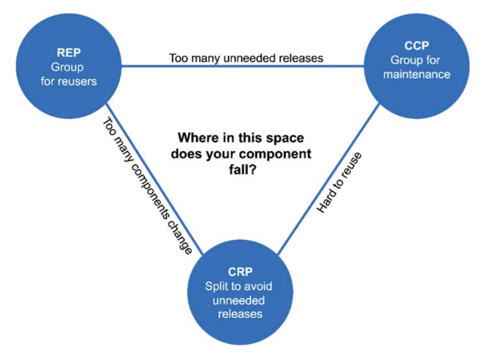

# Clean Architecture
{: .no_toc }

<details open markdown="block">
  <summary>
    Table of contents
  </summary>
1. TOC
{:toc}
</details>

## Part I: Introduction
### Chapter 1: What is Design and Architecture?
Traditionally, architecture seems to imply high level details, while design is low-level structures and details, but little details support high-level details-- it's all part of the same whole of the system.

**The goal of software architecture is to minimize the human resources required to build and maintain the required system.**

The measure of design quality is measure of effort required to meet needs of customer.

Developers tell themselves two lies:
1. "We can clean it up later; we just have to get to market first" -- never clean it up because market is always moving
2. writing messy code is faster than clean code -- it never is

"The only way to go fast is to go well".

#### Summary
{: .no_toc }
Avoid overconfidence and take software design seriously.

In order to take software design seriously, you need to know what good design and architecture is -- you need to know attributes of a system that minimizes effort and maximizes productivity.

### Chapter 2: A Tale of Two Values
Every software system provides two different values to stakeholders:

**Behavior**
- the way a system behaves, written in a functional specification or requirements document then written in code
- when system doesn't behave the way it is supposed to, programmers then debug

**Architecture**
- software of a system, subject to change
- difficulty in making a change should be proportional to the scope of the change, not shape
- new requirements roughly fit the same scope, but they often no longer fit the shape of the system and thus are increasingly difficult
- architectures should be as shape-agnostic as practical

Is a system working (behavior) or the ease of change (architecture) more important? If a program is impossible to change, it will become useless, but if it is easy to change, it can be made useful.

**Eisenhower's Matrix**

|---|---|
| important & urgent | important & NOT urgent |
| NOT important & urgent | NOT important & NOT urgent |

- _behavior_ is urgent but not always particularly important
- _architecture_ is important but never particularly urgent

Business managers are not equipped to evaluate the importance of architecture, so it is responsibility of software dev team to assert importance of architecture over urgency of features.

## Part II: Programming Paradigms
### Chapter 3: Paradigm Overview

#### Structured Programming
{: .no_toc }
- discovered by Edsger Wybe Dijkstra in 1968
- `goto` statements harmful to program structure, replace with `if/then/else` and `do/while/until` constructs
- _"Structured programming imposes discipline on the direct transfer of control"_

#### Object-Oriented Programming
{: .no_toc }
- discovered by Ole Johan Dahl and Kristen Nygaard in 1966
- _"Object-oriented programming imposes discipline on the indirect transfer of control"_

#### Functional Programming
{: .no_toc }
- discovered before computers by Alonzo Church who in 1936 invented $ \lambda$-calculus (lambda calculus)
- typically no assignment statements
- _"Functional programming imposes discipline on assignment"_

Patterns typically _take_ something away and are negative in intent, meaning there likely isn't anything else to take away and there won't be any other paradigms. All three were invented before 1968 and there's been nothing since.

#### Summary
{: .no_toc }
- we use polypmorphism to cross architectural boundaries
- we use functional programming to impose discipline on the location of and access to data
- we use structured programming as the algorithmic foundation of our modules

### Chapter 4: Structured Programming
Dijkstra saw that programming was hard, and the cognitive load was too high to keep all details in mind at once. His answer was to use the mathematical discipline of _proof_, or the idea of using composable elements to create programs.

The use of `goto` prevented a program from being able to be decomposed recursively, and that good uses of `goto` really corresponded to `if/then/else` or `do/while` control structures.

All programs can be built from three elements: _sequence_, _selection_, and _iteration_.

Eventually, `goto` was phased out, and we are all 'structured' programmers in the sense that languages don't give us the option to use undisciplined direct transfer of control.

Proofs ended up being too difficult, but the scientific method replaced proofs. The central idea is that things are _falsifiable_ but not provable, as in, you can only prove something is false rather than proving it is true.

Dijkstra: "Testing shows the presence, not the absence, of bugs".

Structured programming allows us to decompose a program into small provable functions that are falsifiable, i.e., testable.

#### Summary
{: .no_toc }
Ability to create falsifiable units of programming that makes structured programming valuable today, and the reason unrestrained `goto`s aren't used.

Functional decomposition is great practice.

Software is like a science, from low to high level, and is driven by falsifiability. Architects define modules, components, and services that are easily testable (falsifiable), using restrictive disciplines.

### Chapter 5: Object-Oriented Programming
What is OOP? Some say "combo of data and function", but that implies that `o.f()` is different from `f(o)` , which is absurd. Others say it is a way to model real world, but this is too loose and evasive.

Many say it is attributes of _polymorphism_, _encapsulation_, and _inheritance_.

#### Encapsulation
{: .no_toc }
Being able to draw a cohesive line around data and functions, seen as private data members and public functions of a class.

Perfect encapsulation exists in C, a non-OO language. Data structures and functions would be declared in header files and implementation files would take care of the details, and users didn't have access to implementation files. Once OO was introduced with C++, you lost perfect encapsulation.

Introducing `public`, `private`, and `protected` keywords a way to regain encapsulation, but this is a hack. **Many OO languages have little or no encapsulation.**

#### Inheritance
{: .no_toc }
Inheritance is simply the redeclaration of a group of variables and functions within an enclosing scope.

OO languages allow for easier inheritance that isn't a workaround, as well as multiple inheritance, but this functionality exists in non-OO languages

#### Polymorphism
{: .no_toc }
Giving a single interface to entities of different types (think, file interface in Unix)

```c
struct FILE {
  void (*open) (char* name, int mode);
  void (*close) ();
  int (*read) ();
  void (*write) (char) ;
  void (*seek) (long index, int mode);
}
```

Polymorphism is an application of pointers to functions, which have been in use for a long time. OO allowed this to be much safer, however, as pointers to functions are _dangerous_, relying on manual conventions. OO eliminates these conventions.

Unix chose to make IO devices plugins (polymorphism allows things to becomes plugins to the source code) because _device independent_ programs are more adaptable. For example, punch cards to magnetic tape. Most OS's implement this device independence.

#### Dependency Inversion
{: .no_toc }
In typical calling tree, high level functions call mid level functions, which call low level functions, etc. The caller was forced to mention the name of the module that contained the callee, meaning that the flow of control was dictated by the behavior of the system.


```plantuml!
allow_mixing

interface interface {
+F()
}

class ML1 {
+F()
}

component HL1

HL1 -r-> interface
ML1 -u-|> interface
HL1 .d.> ML1
```

Polymorphism means any source code dependency, no matter where it is, can be inverted. What this means is that working in systems written in OO languages have _absolute control_ over direction of all source code dependencies.

```plantuml!
[UI] -l-> [Business Rules]
[Database] -r-> [Business Rules]
[Business Rules] .l.> [UI]
[Business Rules] .r.> [Database]
```

Database and UI depend on the Business Rules, and from here components can be _deployed independently_.

#### Summary
{: .no_toc }
OO is the ability, through the use of polymorphism, to gain absolute control over every source code dependency in the system. Architect can create plugin architecture where modules that contain high-level policies are independent of modules that contain low-level details, and all these modules can be deployed independently.

### Chapter 6: Functional Programming
We might write a program to compute squares in Java like this:
```java
for (int i=0; i <25; i ++>) {
  System.out.println(i*i);
}
```

In Clojure, a derivative of Lisp, it'd look like this:
```clojure
(println (take 25 (map (fn [x] (* x x)) (range))))
```

The key to functional programming is that variables do not vary (are immutable). In Java, the `i` variable mutates.

#### Immutability and Architecture
{: .no_toc }
All race conditions, deadlock conditions, and concurrent update problems are due to mutable variables, and if no variable is ever updated you can't have these concurrency problems.

We might be able to make everything immutable, if we had infinite storage and infinite processing power.

One compromise is to split mutable and immutable components, and to protect the mutable component by using a transaction or retry-based memory in front of that mutable component.

```plantuml!
[Immutable Component 1] -d-> [Mutable Component 1]
[Immutable Component 2] -d-> [Mutable Component 1]
[Immutable Component 3] -d-> [Mutable Component 1]
[Mutable Component 1] <-d-> [Transactional Memory]
```

Architects should push as much processing as possible to immutable components.

#### Event Sourcing
{: .no_toc }
Store only the transactions, and re-compute the state as needed. For example, banks store withdrawals and debits, and if the account balance is needed, all the debits and withdrawals are tallied. Nothing is ever deleted or updated, instead of CRUD we have CR.

This is the way source control system works.

#### Summary
{: .no_toc }
Each paradigm takes something away. We have learned what not to do, but software is not a rapidly advancing tech, and the rules are the same as they were in 1946. Software is still composed of sequence, selection, iteration, and indirection.

## Part III: Design Principles
SOLID principles tell us how to arrange functions and data into classes. The goal of the principles is the creation of mid-level software structures that:
- tolerate change
- are easy to understand
- are the basis of components that can be used in many software systems

### SOLID Principles
{: .no_toc }
**SRP**: The Single Responsibility Principle
- each software module has one, and only one, reason to change

**OCP**: The Open-Closed Principle
- systems should be easy to amend by adding new code, not changing existing code

**LSP**: The Liskov Substitution Principle
- to build a software system from interchangeable parts, those parts must adhere to a contract that allows those parts to be substituted for one another

**ISP**: The Interface Segregation Principle
- avoid depending on things you don't use

**DIP**: The Dependency Inversion Principle
- code that implements high-level policy should not depend on the code that implements low-level details but rather should rely on policies

### Chapter 7: SRP: Single Responsibility Principle
_"A module should be responsible to one, and only one, actor."_

A module is a cohesive set of functions and data, typically a source file.

Best to look at symptoms of violating this principle.
#### Symptom 1: Accidental Duplication
{: .no_toc }
```plantuml!
allow_mixing
left to right direction

class Employee {
  +calculatePay();
  +reportHours();
  +save();
}

actor accounting
actor humanresources
actor dbas

accounting --> Employee
humanresources --> Employee
dbas --> Employee
```

Three different actors responsible for three different methods - accounting department for `calculatePay()`, human resources for `reportHours()`, and DBAs for `save()`. If two methods rely on the same underlying algorithm, changing it will change its affect on both methods, which might cause problems.

#### Symptom 2: Merges
{: .no_toc }
If there are two actors that need to change a source file and those file changes need to be merged together, this is a symptom of violation of SRP.

There are a few solutions to this problem, and they all involve separating the code from the single class. We could create three classes, one for each method, and then thread them together using the _Facade_ pattern.

#### Summary
{: .no_toc }
SRP is about functions and classes, but it appears at two more levels:
- at components, it becomes Common Closure Principle
- at architectural, it is Axis of Change (responsible for creating Architectural Boundaries)

### Chapter 8: OCP: The Open-Closed Principle
_"A software artifact should be open for extension but closed for modification"_

The behavior of a software artifact should be extendible without having to modify that artifact.

When we design architecture, we want component relationships to be unidirectional, and components that should be protected from change should be depended on by lower level components, i.e., if component A should be protected from changes in component B, component B should rely on component A.

At the architectural level, we separate functionality based on how, why, and when things change, and then organize that separated functionality into a hierarchy of components. High-level components are protected from changes made to low-level components.

#### Summary
{: .no_toc }
The goal of OCP, one of the driving forces behind architecture of systems, is to make the system easy to extend without incurring a high impact of change. We partition the system into components, and arrange those components in a dependency hierarchy that protects higher-level components from changes in lower-level components.

### Chapter 9: LSP: The Liskov Substitution Principle

_"What is wanted here is something like the following substituion property: If for each object `o1` of type `S` there is an object `o2` of type `T` such that for all programs `P` defined in terms of `T`, the behavior of `P` is unchanged when `o1` is substituted for `o2` then `S` is a subtype of `T`."_

The following design conforms to LSP because Billing does not depend in any way on the two subtypes of License.

```plantuml!
object Billing

interface License {
+calcFee
}

object PersonalLicense
object BusinessLicense

Billing -r-> License
PersonalLicense -u-> License
BusinessLicense -u-> License
```

The canonical violation of LSP, the Square/Rectangle problem below:

```plantuml!
object User

class Rectangle {
+setH
+setW
}

class Square {
+setSide
}

User -r-> Rectangle
Square -u-|> Rectangle
```

#### Summary
{: .no_toc }
LSP should be extended to the level of architecture. Violating substitutability can cause a system's architecture to be polluted with a significant amount of extra mechanisms.

### Chapter 10: ISP: Interface Segregation Principle
_"No client should be forced to depend on methods it does not use."_

Source code dependencies are often language dependent: in statically typed languages like Java, programmers declare source code dependencies, and changes would force recompile and redeploy. In dynamically typed languages like Python and Ruby, these dependencies are inferred at runtime and thus allow more flexible and loosely coupled systems to be created.

ISP still has architectural ramifications, however: imagine System S implementing Framework F on top of Database D. Changes to Framework F, even if System S doesn't use them, might require redeploys to Database D and System S.

### Chapter 11: DIP: The Dependency Inversion Principle
_"The most flexible systems are those in which source code dependencies only refer to abstractions, not concretions."_

While we can't completely avoid relying on concretions (`String` in Java, for example), we should be worried about _volatile_ concrete elements, those subject to frequent change. We can rely on stable abstractions and reduce the volatility of interfaces by adding functionality to implementations without making changes to interfaces.

This boils down to a specific set of coding practices:
- **Don't refer to volatile concrete classes** - refer to abstract classes instead
- **Don't derive from volatile concrete classes** - corollary of previous rule
- **Don't override concrete functions** - concrete functions require source code dependencies, and overriding them does not eliminate those dependencies, you inherit them
- **Never mention the name of anything concrete and volatile** - a restatement of the principle itself

We use _Factories_ to manage the dependency and create the class. This allows us to separate the system into two components, one concrete, the other abstract.

#### Summary
{: .no_toc }
DIP is the most visible organizing principle in architecture diagrams, and the separation between concrete and abstract will inform all diagrams. The _Dependency Rule_ is the way in which dependencies cross from concrete to more abstract in a single direction.

## Part IV: Component Principles

### Chapter 12: Components
**Components are the units of deployment.** jar files in java, gem files in Ruby, DLL in .NET. In compiled languages, they are aggregation of binary files, and in interpreted languages they are aggregations of source files.

Well-designed components retain the ability to be independently deployable and thus independently developable.

### Chapter 13: Component Cohesion
Three principles of component cohesion:
1. **The Reuse/Release Equivalence Principle** (REP)
- people who want to reuse software components can not and will not do so unless those components are tracked through a release process and are given release numbers, and developers might choose to upgrade or not based on change log
- from arch. view, classes and modules that are formed into a component must belong to a cohesive group; grouped classes and modules should be releasable together

2. **The Common Closure Principle** (CCP)
- _"Gather into components those classes that change for the same reasons and at the same times. Separate into different components those classes that change at different times and for different reasons."_
- most of the time maintainability is more important than reusability, so gathering components that change at the same time together enhances maintainability
- SRP restated for components, as well as Open Closed principle (open for extension but closed for modification)

3. **The Common Reuse Principle** (CRP)
- Classes and modules that tend to be reused together belong in the same component
- CRP tells us more about which classes _shouldn't_ be part of a component -- if classes and modules are together, they should be inseparable. \
- _"Don't depend on things you don't need"_

#### Tension Diagram for Component Cohesion
These principles are often in contention.


### Chapter 14: Component Coupling
#### The Acyclic Dependencies Principle
{: .no_toc }
In the past, there was an idea to allow relative isolation for developers to work collaboratively which was to defer that integration until the end of the week, i.e., _a weekly build_. Eventually, the integration time creeps earlier in the week, and the build schedule grows, and this is not ideal.

A solution to the above would be to partition development into releasable components owned by a single dev or a team of devs, so consuming teams might choose whether they want to update their used components.

Integration now happens in small increments, and no team is at the mercy of others; integration can be continuous.

In order to make this work, you need to manage the _dependency structure_, and there can be no cycles; regardless of what component you end up at, it is impossible to follow the dependency tree and end up at the original component. We need a _directed acyclic graph_ (DAG).

We know how to build systems when we understand the dependencies between its parts.

With cycles in the dependency graph, it is very difficult to work out order in which you must build components.

There are two ways we could break the cycle:
1. Use the dependency inversion principle (DIP) to create an interface of the used methods
2. create a new component with the classes that the two components depend on

As systems grow, these dependencies will appear; the component structure can't be designed from the top down. We have come to expect that large-grained decompositions like components, will also be high-level functional decompositions.

> Decomposition in computer science, also known as factoring, is breaking a complex problem or system into parts that are easier to conceive, understand, program, and maintain.

In reality, component dependency diagrams have little to do with the function of a system, they are merely describing _buildability_ and _maintainability_.

One of the overriding concerns is the isolation of volatility: we don't want frequently changing components to affect stable, high-value components. We don't want to change business rules because our GUI changes.

This process needs to happen after we've built the system a bit: we don't know about common closure, we don't know about reusable elements, and we almost certainly would create dependency cycles.

#### Stable Dependencies Principle
{: .no_toc }
Ensures that modules that are intended to be easy to change are not depended on by modules that are harder to change.

**Stability** is related to the amount of work required to make a change.

```plantuml!
[A] -d-> [X]
[B] -d-> [X]
[C] -d-> [X]
```

Component X is stable, because three components depend on it. X is _responsible_ for three components, but depends on none, so it is _independent_.

```plantuml!
[Y] -d-> [A]
[Y] -d-> [B]
[Y] -d-> [C]
```

Component Y is very unstable. No components depend on it, so it is irresponsible, and it is dependent. Changes may come from three external sources.

**Stability Metrics**
We can count the dependencies coming in and going out of a component, and this is the _positional_ stability of the component
- _Fan-in_: incoming dependencies
- _Fan-out_: outgoing dependencies
- _Instability_: $ \int_0^1 I = Fanout \div (Fanin + Fanout) $

When I is equal to 1, no other component depends on this component -- it is irresponsible and dependent, meaning there is no reason not to change it if needed

When I  is equal to 0, it means the component is depended on by other components but does not itself depend on other components. It is responsible and independent (and stable) -- lots of dependents make it hard to change and nothing forces it to change.

I metric of a component should be larger than the I metrics of the components that it depends on, that it should decrease in the direction of the dependency.

Changeable components on top and stable components on bottom.

#### The Stable Abstractions Principle
{: .no_toc }
_"A component should be as abstract as it is stable"_

- $ Nc $: the number of classes in the component
- $ Na $: the number of abstract classes and interfaces in the component
- $ A $: abstractness.$ A = Na \div Nc $

Best components are maximally stable and abstract, and maximally unstable and concrete.

- **Zone of Pain** - highly stable, concrete -- if these components are volatile (need to be changed often), this is painful
- **Zone of Uselessness** - maximally abstract but no dependents -- these components are useless

## Part V: Architecture

### Chapter 15: What is Architecture?
