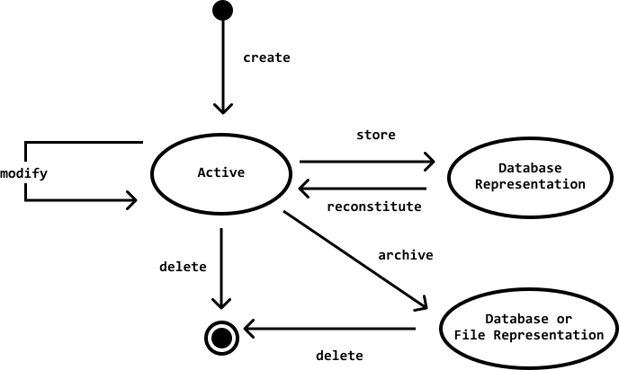
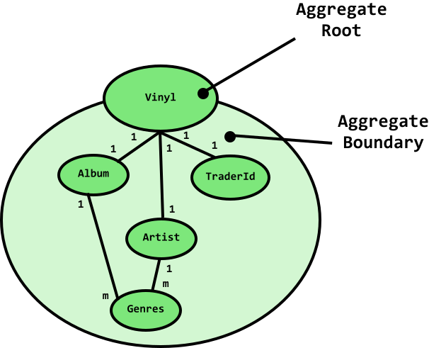

# Domain Driven Design: Tackling Complexity in the Heart of Software
{: .no_toc }
Eric Evans, 2003

  

    Table of contents
  

1. TOC
{:toc}

## 6: The Life Cycle of a Domain Object

### Aggregates
- a cluster of associated objects that we treat as a unit for the purpose of data changes
- the root of an aggregate is the only member of the **AGGREGATE** that outside objects are allowed to hold references to
- it is difficult to guarantee consistency of changes to objects in a model with complex associations
- invariants need to be maintained that apply to closely related groups of objects, not just discrete objects
- cautious locking schemes cause multiple useers to interfere pointlessly with each other to make the system almost unusable

- cluster **ENTITIES** and **VALUE OBJECTS** into **AGGREGATES** and define boundaries around each
- choose one **ENTITY** to be root, and control access for everything inside via the root (external objects can only hold reference to the root)
- transient references to internal members can be passed out only for single operation
- because root controls access, it will be aware of changes to internals
- you can then enforce invariants for anything within the **AGGREGATE**

### Factories

### Repositories