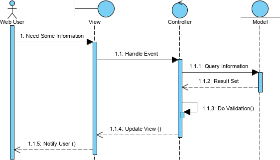

# Patterns of Enterprise Application Architecture
## What is Architecture?
1. high level breakdown of system into parts
2. decisions that are hard to change

> In the end, architecture boils down to the important stuff -- whatever that is. (2)

- most widely used technique is to break (decompose) the application into layers and how these layers work together

## Enterprise Applications
- they involve persistent data around for multiple runs of an application
- lots of data
- many users access data concurrently which involves potential access issues
- lots of user interface screens to interact with data
- need to integrate with other apps in a variety of different languages/stacks
- conceptual dissonance between technology and data -- needs to be read, munged, & written in a variety of syntactic and semantic flavors
- complex business "illogic" to handle domain complexity

## Performance
- any performance advice shouldn't be treated as fact until actually tested
- basic, universal advice - **minimize remote calls**
- significant changes to config will invalidate assumptions about performance
- some performance vocab
  - **response time** - time it takes for system to process response fromt he outside
  - **responsiveness** - how quickly system acknowledges requests as opposed to processing
  - **latency** - minimum time required to get any form of response
  - **throughput** - how much stuff you can do in a given time
  - **load** - how much stress a system is under
  - **load sensitivity** - how response time varies under load (a system degrades under load)
  - **efficiency** - performance divided by resources
  - **capacity** - max effective throughput or load
  - **scalability** - how additional resources affect performance and can either be horizontal (scaling out, adding new machines) or vertical (scaling up, adding memory, CPU, storage to a machine)

## Pattern

> Each  pattern  describes  a  problem which  occurs  over  and over  again in our environment, and then describes the core of the solution to that problem, in a  way  that  you  can  use  this  solution  a  million  times  over, without  ever doing it the same way twice. (9)

- focus of a pattern is a common and effective solution to a particular problem
- don't read all the details of each pattern, just enough to know what to look up
- never apply a solution blindly
- value isn't giving you the idea of a pattern but rather helping you communicate it

## Layers
- way to decompose complicated software systems
- high level layer uses lower level services, but lower level should remain unaware of higher level
- benefits:
  - single layer as a coherent whole without knowing much about other layers
  - you can substitute layers
  - minimize dependencies between layers
  - layers are good places for standardization
  - lower layers can be reused for multiple higher level services
- downsides:
  - you can't encapsulate everything (thinking adding an additional UI element requires database changes and corresponding changes to all intermediary layers)
  - performance hit for layering

## 3 Principal Layers
- **presentation** - handles interaction between user and software - interprets actions/commands and displays info to user
- **data source** - communicates with other systems that carry out task on behalf of the application
- **domain logic** - business logic that is work the application does for the domain you're working in

| Layer        | Responsibilities                                                                                                                                                                      |
|--------------|---------------------------------------------------------------------------------------------------------------------------------------------------------------------------------------|
| Presentation | Provision of services, display of information (e.g., in Win-dows or HTML, handling of user request (mouse clicks, keyboardhits), HTTP requests, command-line invoca-tions, batch API) |
| Domain Logic | that is the real point of the system                                                                                                                                                  |
| Data Source  | Communication with databases, messaging systems, trans-action managers, other packages                                                                                                |

- **hexagonal architecture** - any system as a core surrounded by interfaces to external systems -- this is a symmetrical view that doesn't distinguish between services you provide and services you consume
- choose most appropriate for of separation for problem, but make sure there is separation
- domain and data source should never be dependent on presentation
- generally, we are talking about logical layers -- typically physical layers break down to client vs. server
- don't separate layers into discrete processes unless needed.
- **complexity boosters**: they all come at a cost. *e.g.,* extreme performance requirements, explicit multi-threading, distribution, paradigm chasms

## Domain Logic
3 patterns to organize domain logic
- _transaction script_
- _domain model_
- _table module_

## Transaction Script
- _transaction_ here is used in the sense of a business operation, not an ACID-compliant database transaction
- single procedure for each action a user might want to do
- useful for very simple domains, since as logic increases in complexity, duplication increases, and application code becomes hard to untangle
- all behavior for action is within the transaction script

## Domain Model
- build a model of the domain around the nouns in the domain
- behavior then is in the interactions between objects
- moving to domain model involves a paradigm shift to object-oriented thinking
- have to deal with more complex mapping to database

## Table Module
- looks like domain model, but instead of object for all nouns, you get an object for every table in the database
- pulls all records as a _Record Set_ from the database, and in order to work on 1 you'd pass in an `id` to that _Record Set_
- there needs to be special tooling for these _Record Sets_

## Record Set
- in memory representation of tabular data
- looks exactly like the result of a SQL query but can be manipulated by other parts of the system
- can easily be manipulated by domain logic
- typically a list of maps: `[{...}, {...} ...]`
- can have an implicit or implicit interface (think `person['name']` vs `person.name`)
- can be connected (need active connection to database), or disconnected (can be manipulated offline)

## Service Layer
- defines application boundary with a layer of services that establish a set of available actions (API) & coordinates the applications response to each operation
- lay over a _Domain Model_ or a _Table Module_ and provides a clean API & a good spot to put things like transaction control and security
- minimal case is to make it a _Façade_, maximal is to put business logic in it
- **controller entity** - have logic and behavior exclusive to use case or transaction in a separate _Transaction Script_ called a controller or service type

## Gateway (Base Pattern)
- an object that encapsulates access to an external resource or system
- in reality, this is a simple wrapper pattern
- good spot to apply service stub
- some overlap with Gang of Four patterns _Façade_ and _Adapter_
- useful for encapsulating an awkward interface for something rather than letting it affect rest of code
- if you need to decouple subsystems, another choice is _Mapper_, but this is more complicated

## Mapper (Base Pattern)
- an object that sets up communication between two independent objects
- similar to _Mediator_
- useful when you want neither subsystem to have dependency on their interaction, like with a database (_Data Mapper_)

## Service Stub
- removes dependence on problematic services while testing
- in extreme programming, this is called a "mock object"
- should be as simple as possible
- replace service with service stub that runs in memory and locally

## Managing Database Connections
- connections act as the link between application code and the database
- expensive to create, so preferable to use a pool (although verify a pool helps performance as with some modern data source tooling it doesn't matter -- best to use a connection manager to encapsulate the connection entirely)
- connections must be closed as soon as you are done, and might be done in two ways:
  - rely on garbage collection to close, but garbage collection isn't immediate
  - explicit closing, which is riskier and more prone to forgetting
- a good approach is to tie connection open and close with a transaction

## Table Data Gateway
- an object that acts as a gateway to a table -- one object handles all rows in a table
- way to stop mixing SQL into application logic
- simple interface with several find, update, insert, delete methods
- useful to think of as a wrapper for SQL statements

## Row Data Gateway
- an object that acts as a gateway to a single row in the database -- one instance per row
- exactly mimics a single record
- if there is any domain logic in this object, then it is _Active Record_
- useful with _Transaction Script_ and less so with _Domain Model_

## Active Record
- an object that wraps a row in a database table or view, encapsulates database access, and adds domain logic to that object
- each _Active Record_ is responsible for saving to and loading from the database, and also any behavior (domain logic) that exercises on that object
- should exactly match the database
- good for domain logic that isn't that complex -- create, read, update, delete operations

## Data Mapper
- a layer of mappers that moves data between objects and a database while keeping them independent of each other and the mapper itself
- separate in memory objects from the database via a layer of software
- primary occasion to use is when you want the database schema and the object model to evolve independently
- price is the extra layer required to maintain
- more complicated business logic leads to _Domain Model_ or _Data Mapper_

## Unit of Work
 - maintains a list of objects affected by a business transaction and coordinates the writing out of changes and the resolution of concurrency problems
 - when it comes time to commit, the _Unit of Work_ decides what to do -- _i.e.,_ open a transaction, concurrency checks, writes changes to a database
 - keeps track of all objects you modify, so all you need to worry about are the objects altered in synching in memory data to database
 - great strength is that it keeps all info in one place

## Identity Map
- ensures that every object only gets loaded once, and keeps each object in a map -- looks up objects in the map when referring to them
- primary key or surrogate key (any column or set of columns that can be used as a PK instead of natural key _e.g.,_ incrementing integer)
- either **explicit** (each data point has access method) or **generic** (one access method for all data)
- useful if any data needs to be pulled from the database and modified
- also useful as transactional cache
- won't help for cross-session concurrency protections, as this is meant for single session

## Lazy Load
- an object that doesn't contain all the data you need but knows where to get it
- **lazy initialization** - use `NULL` to signal field hasn't been loaded yet
- **value holder** object that wraps other object -- ask the value holder for data and it goes to the data source (useful for avoiding identity problems of virtual proxy)
- **virtual proxy** - object that looks like object in the field but doesn't contain anything -- only returns data when one of its methods are called
- **ghost** - a real object in a partial state
- **ripple loading** - when you cause more database accesses than needed, hurting performance

## Web Server
- web server's job to interpret URL of request and hand over control to a web server program
- 2 ways of structuring program in a web server - as a script or as a server page
- script works best for interpreting the request, server page for formatting a response
- this leads to _Model-View-Controller_ pattern

## Model-View-Controller
- request comes to input controller
- input controller pulls info from request
- forwards business logic to model object
- model object talks to data source and does what is indicated in request, as well as gathers info for response
- control passed to input controller from model, which decides what view to select
- control is passed to view along with response data for dipslay
- most important reason for MVC is to separate models from presentation

## Application Controller
- different from input controller in MVC -- controls the flow of the application
- good rule of thumb is if machine is in control of screen flow, it is useful, and if the user is in control, it is not

## Offline Concurrency
- concurrency control for data that's manipulated during multiple database transactions

## Lost Updates
- when someone starts an update after someone & finishes before them, the first transaction will wipe out the second

## Inconsistent Reads
- when a transaction reads object `x` twice and `x` has different values -- between the two reads, someone modified `x`

## Correctness vs. Liveness
- correctness (or safety, consistency) vs. liveness (how much concurrent activity can go on)
- these concepts are in contention (think CAP theorem)

## Execution Contexts
- **request** - a single call from outside world that the software works on a potentially sends a response back
- **session** - a long-running interaction between client and service in which multiple requests can happen
- **process** - a heavy weight execution context that provide isolation with internal data
- **thread** - lighter weight active agent that's set up for multiple threads in a single process but memory is often shared so there can be concurrency problems
- **isolated threads** - threads that don't share memory
- **transaction** - pulls together several requests the client wants to treat as a single request

## Isolation
- partition data so it can only be access by one active agent, _e.g.,_ OS memory or file locks

## Immutability
- if data can't be modified there is no concurrency problem

## Optimistic vs Pessimistic Concurrency Control
- optimistic allows multiple users to edit data and only reconciles differences on save
- pessimistic allows one agent to edit data and gives others read only access
- optimistic is conflict detection while pessimistic is conflict prevention
- pessimistic reduces concurrency while optimistic makes conflict resolution tricky
- choice comes down to frequency and severity of conflicts

## Deadlocks
- occurs with pessimistic control when 2 or more processes need to acquire locks the others are holding
- can use victims, or when deadlocks appear the process that will lose data
- also can use timeouts, or enforce all locks are acquired at the beginning
- deadlocks are easy to get wrong so simple, conservative schemes work best

## Transaction
- a transaction is a bounded sequence of work with the start and end well-defined
- all participating resources in a consistent state at the beginning and end
- must complete on all or nothing basis

## Transaction Isolation

| Isolation Level  | Dirty read   | Non-repeatable read | Phantom Read |
|------------------|--------------|---------------------|--------------|
| READ UNCOMMITTED | Possible     | Possible            | Possible     |
| READ COMMITTED   | Not Possible | Possible            | Possible     |
| REPEATABLE READ  | Not Possible | Not Possible        | Possible     |
| SERIALIZABLE     | Not Possible | Not Possible        | Not Possible |

## ACID
- **atomicity** - all steps in sequence must complete or be rolled back
- **consistency** - system's resources must be in a consistent, non-corrupt state
- **isolation** - results of transaction must not be visible to any other transaction until the transaction is complete
- **durability** - any results must be made permanent

## Process Per Session
- one way of handling concurrency is to have a single process per session
- avoids all the problems of multi-threading, and is equally isolated memory-wise
- downside is processes are expensive, so you can use pooled **process-per-request**
- need to ensure all resources are released at end of request
- **thread-per-request** if further performance is needed -- this has a fair bit of multi-threading overhead, so process-per-request is often sufficient

## Session State
- state (data) retained in between requests or across business transactions
- different from record data, which is session state persisted to disk
- session state might not be consistent (ACID consistent) at any point
- biggest problem with session state is isolation
- three ways to store session state
  - **client session state** - stores on client, _e.g.,_ cookies, encoding in URL, hidden forms
  - **server session state** - store on server _e.g.,_ in memory, or more durably as a serialized object
  - **database session state** - stored in a database
- with client, data needs to be transferred over the wire, so ideal for smaller payloads
- also need to deal with security and encryption, so client-side presume all data is available

## Session Migration vs. Server Affinity
- session migration allows a session to move from server to server as it handles a request
- server affinity forces one server to handle all requests
  - might be problematic if all requests are clustered and go to same server

## Other Session State Concerns
- what happens when a user cancels requests or leaves? cleaning up state might be tricky on the server or the database side
- development effort -- database and client side are the heaviest lifts
- if server session data stored so it can survive a crash, this might be ideal

## Fine-Grained Interface
- separate setters and getters for each property
- optimized for future extensibility (OO principle)
- not useful for objects used remotely because of number of calls

## Coarse-Grained Interface
- grouped setters and getters
- minimize calls - optimized for remote calls
- lose flexibility and extensibility

## Distributed Object Design
1. _Don't distribute objects_ - a procedure call within a process is fast, across 2 processes is slower, and processes running on separate machines is slower still
2. *Minimize distribution boundaries and use clustering as much as possible* - sometimes there are needs for boundaries _e.g.,_ client-server, app-db
3. _use remote facade pattern_ - use coarse-grained at the distribution boundaries, fine-grained internally
- this advice based on Remote Procedure Call synchronous architecture, and message-based async might be preferable
